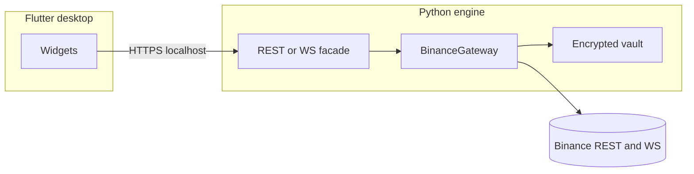

# Target architecture (Flutter desktop + Python engine)

Human coordination in Spanish (`README` policy); technical identifiers and code remain English.

## Current state

- Python package `runtime/`: FastAPI HTTP API under `runtime/api/` (default `127.0.0.1:8000`), Binance gateway (`python-binance`), encrypted vault, and multi-instance hubs for Dorothy/Elphaba.
- Runtime now exposes a modular domain layer under `runtime/modules/`:
  - `runtime/modules/bots/`
  - `runtime/modules/tools/`
- Flutter desktop under `desktop_shell/` is the primary and only UI path.

## Operational doctrine

- Trading objective: **compound profit** over repeated cycles.
- Losses are not forbidden in practice; they are treated as unavoidable events to be **contained**, **audited**, and **recovered** from with strict controls.
- Every operation path (bot loops, cleanup protocols, red button, account reads) should prioritize:
  - deterministic inputs (active credential + base asset),
  - timestamp correctness against Binance server,
  - traceability in SQLite logs and audit records.

## Target layout

```
PecunatorCore/
├── runtime/             # Python engine
├── bots/                # Root bot module index (one folder per bot)
├── tools/               # Root tool module index (one folder per operational tool)
├── desktop_shell/       # Flutter desktop (run scripts/ui/init_flutter_desktop.ps1)
├── examples/            # Reference-only historical examples (not runtime)
├── docs/
└── scripts/
```

1. **`runtime` (Python)**  
   - Exposes API surface and orchestrates domain modules.
   - Keeps `runtime/main.py` as the engine entrypoint consumed by root `main.py`.
   - Groups bot/tool modules under `runtime/modules/` to reduce coupling with API route files.

2. **`desktop_shell` (Flutter)**  
   - Desktop app; talks only to the engine over HTTP(S) loopback; no API keys in Dart.

3. **Boundaries**

   - Credentials stay in Python `runtime/data/` vault; never in Flutter.
   - Bot instances consume quote assets (e.g. USDT) and attempt to return quote/base with spread benefit according to `profit_factor` and operational constraints.
   - Equity metrics are computed in backend and rendered in UI; UI is not a source of truth for balances.

## Module map (what owns what)

- `runtime/main.py`
  - Engine startup and API server lifecycle.
- `runtime/modules/bots/`
  - Bot strategy modules (Dorothy, Elphaba).
- `runtime/modules/tools/`
  - Operational tools (ops protocols, sandbox, rest-weight telemetry boundaries).
- `runtime/bot/`
  - Compatibility bridge for legacy imports while migration converges on `runtime/modules/bots/`.
- `runtime/connectors/binance_gateway.py`
  - Account polling, market streams, REST weight tracking, equity refresh cadence.
- `runtime/core/`
  - Shared primitives (vault, settings, state store, audit stores, equity math).
- `runtime/api/*.py`
  - API façade + per-bot services + schema surface.
- `bots/*/MODULE.md` and `tools/*/MODULE.md`
  - Root-level module index for discoverability and expansion planning.
- `desktop_shell/lib/main.dart`
  - Operator UI for credentials, instances, protocols, spot/equity and sandbox.



## Migration phases

| Phase | Action |
|-------|--------|
| 0 | Web stack removed; Flutter + engine API is the plan. |
| 1 | Flutter SDK; `scripts/ui/init_flutter_desktop.ps1` → `desktop_shell/`. |
| 2 | ✅ FastAPI facade in `runtime/api/` wired with Flutter `http` client. |
| 3 | ✅ Flutter screens integrated for vault, hub instances, and logs. |

## Binance limits & compliance

Operational reference (Spanish): [`binance-api-and-compliance.md`](binance-api-and-compliance.md). Update when Binance changes REST/WebSocket policies or Pecunator polling defaults (`PECUNATOR_ACCOUNT_POLL_SEC`, etc.).

Dated `exchangeInfo.rateLimits` JSON snapshots: [`binance-limits-snapshots/`](binance-limits-snapshots/). REST weight header (`X-MBX-USED-WEIGHT-1M`) is surfaced in `GET /api/v1/gateway/snapshot` and in Flutter.

## Renaming `runtime` → `engine`

Optional follow-up once API and imports are stabilized.

## `main` vs `runtime` (conventional split)

- Root `main.py` stays as a **thin bootstrap** only (`from runtime.main import main`), useful for `python main.py`.
- `runtime/` is the **actual engine package**:
  - startup lifecycle (`runtime/main.py`),
  - API façades (`runtime/api/`),
  - connectors (`runtime/connectors/`),
  - domain/state (`runtime/core/`, `runtime/modules/`).
- This split is intentionally scalable: CLI/bootstrap can evolve independently while runtime remains testable/importable as a package (`python -m runtime`).
