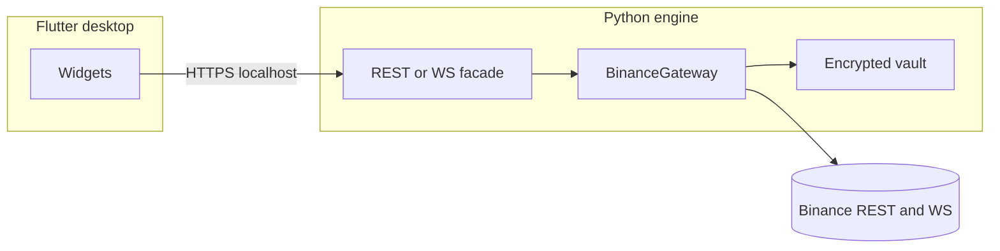

# Target architecture (Flutter desktop + Python engine)

Human coordination in Spanish (`README` policy); technical identifiers and code remain English.

## Current state

- Python package `runtime/`: FastAPI HTTP API under `runtime/api/` (default `127.0.0.1:8765`), plus `BinanceGateway` (`python-binance`), encrypted vault, `AppContext`, and Dorothy multi-instance hub.
- Flutter desktop under `desktop_shell/` is the primary and only UI path.

## Target layout

```
PecunatorCore/
├── runtime/             # Python engine (gateways, vault, connectors) — rename to engine/ later if desired
├── desktop_shell/       # Flutter desktop (run scripts/init_flutter_desktop.ps1)
├── docs/
└── scripts/
```

1. **`runtime` (Python)**  
   - Exposes a narrow **API** (REST + optional WebSocket) from a future module.  
   - Reuses `BinanceGateway`, vault, polling.

2. **`desktop_shell` (Flutter)**  
   - Desktop app; talks only to the engine over HTTP(S) loopback; no API keys in Dart.

3. **Boundaries**

   - Credentials stay in Python `runtime/data/` vault; never in Flutter.



## Migration phases

| Phase | Action |
|-------|--------|
| 0 | Web stack removed; Flutter + engine API is the plan. |
| 1 | Flutter SDK; `scripts/init_flutter_desktop.ps1` → `desktop_shell/`. |
| 2 | ✅ FastAPI facade in `runtime/api/` wired with Flutter `http` client. |
| 3 | ✅ Flutter screens integrated for vault, hub instances, and logs. |

## Renaming `runtime` → `engine`

Optional follow-up once API and imports are stabilized.
