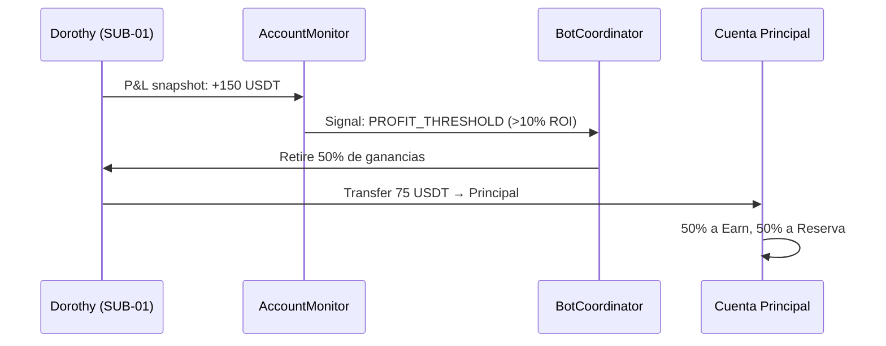

# Flujo de Capital — Aporte, Dispersión y Circulación de Recursos

> **Fecha:** 2026-05-06
> **Estado:** Diseño Arquitectónico (Pre-implementación de subcuentas)
> **Referencia:** Fase 2 del Evolution Plan

---

## 1. Arquitectura de Cuentas

```
╔══════════════════════════════════════════════╗
║              CUENTA PRINCIPAL                ║
║         (Binance Master Account)             ║
║                                              ║
║  ┌──────────┐  ┌──────────┐  ┌──────────┐   ║
║  │ RESERVA  │  │ EARN     │  │ LIQUIDEZ │   ║
║  │ FRÍA     │  │ ACTIVO   │  │ LIBRE    │   ║
║  │ (HODL)   │  │ (Yield)  │  │ (Deploy) │   ║
║  └────┬─────┘  └────┬─────┘  └────┬─────┘   ║
╚═══════╪═════════════╪════════════╪═══════════╝
        │             │            │
        ▼             ▼            ▼
╔═══════════╗ ╔═══════════╗
║  SUB-01   ║ ║  SUB-02   ║
║  Dorothy  ║ ║  Elphaba  ║
║  (Long)   ║ ║  (Short)  ║
╚═══════════╝ ╚═══════════╝
```

---

## 2. Mecanismo de Aporte (¿Cómo entran los fondos?)

### 2.1 Aporte Inicial (Funding)
El operador deposita USDT/crypto en la **Cuenta Principal** de Binance.
Desde ahí, se distribuye manualmente o (en el futuro) vía el
`AccountMonitor + BotCoordinator`:

```
Operador → Depósito → Cuenta Principal → Distribución
```

### 2.2 Aporte Específico a un Bot o Sistema
Para dirigir capital a un bot específico:

| Método | Mecanismo | Estado |
|--------|-----------|--------|
| **Directo (actual)** | Transferir USDT de cuenta principal a subcuenta vía API REST (`POST /sapi/v1/sub-account/universalTransfer`) | Disponible (Fase 2) |
| **Via Coordinator** | `bot_coordinator.allocate(bot_id, amount_usdt)` — el coordinator ejecuta la transferencia y registra en TelemetryVault | Por implementar |
| **Via Dashboard** | Botón en Flutter: "Fondear Dorothy +500 USDT" → llama al endpoint REST del coordinator | Por implementar |

### 2.3 Aporte a un Grupo
Si quieres fondear "todos los bots de trend-following":

```python
# Concepto: el coordinator agrupa bots por tipo y reparte equitativamente
coordinator.allocate_group(
    group="trend_bots",  # dorothy instances
    total_usdt=1000,
    distribution="equal",  # o "weighted_by_winrate"
)
```

---

## 3. Dispersión de Recursos (¿A dónde van?)

### 3.1 Regla de Distribución Base

```
100% Capital Disponible
  ├── 30% → Reserva Fría (HODL, acumulación largo plazo)
  ├── 20% → Earn Activo (staking, savings — rendimiento pasivo)
  ├── 10% → Liquidez de Emergencia (nunca tocar salvo pánico)
  └── 40% → Capital de Trabajo (repartido entre bots activos)
        ├── Dorothy: hasta 50% del capital de trabajo
        └── Elphaba: hasta 50% del capital de trabajo
```

### 3.2 Destino por Subcuenta

| Subcuenta | Bot(s) | Capital Máx | Función |
|-----------|--------|-------------|---------|
| SUB-01 | Dorothy | 50% trabajo | Scalp Long simétrico |
| SUB-02 | Elphaba | 50% trabajo | Scalp Short simétrico |
| SUB-03 | (Reserva) | — | Capital rotativo, buffer |
| SUB-04 | (Earn) | — | Savings/Staking activos |

---

## 4. Circulación (¿Cómo regresan y rotan los fondos?)

### 4.1 Profit Taking (Toma de Ganancias)



**Regla:** Cuando un bot acumula >10% ROI sobre su capital asignado,
el coordinator extrae automáticamente el 50% de las ganancias y las
redirige a la cuenta principal para redistribución.

### 4.2 Rebalanceo Periódico (Mensual)

```
Día 1 de cada mes:
1. AccountMonitor toma snapshot de TODAS las subcuentas
2. Calcula: ¿Quién está sobre-capitalizado? ¿Quién necesita más?
3. Genera señales de rebalanceo (rebalance_signals table)
4. El operador aprueba (o auto-aprobación si <5% del total)
5. Coordinator ejecuta transferencias inter-subcuenta
6. Todo se registra en TelemetryVault (bot_decisions)
```

### 4.3 Movimiento a Earn (Activos Acumulables)

Activos que no necesitan liquidez inmediata (BNB, SOL, ETH en HODL)
se mueven a Flexible Savings o Staking:

```python
# Concepto
coordinator.move_to_earn(
    asset="BNB",
    amount="10.5",
    product_type="FLEXIBLE_SAVINGS",
    source_account="SUB-01",
)
```

### 4.4 Flujo Circular Completo

```
Depósito → Principal → Subcuentas → Bots operan → Ganancias
                ↑                                       │
                └───── Profit Take ← Rebalanceo ←───────┘
                           │
                           ├── Earn (rendimiento pasivo)
                           └── Reserva (acumulación)
```

---

## 5. Resumen del Estado Actual

| Componente | Estado | Responsable |
|------------|--------|-------------|
| Detección de necesidad de rebalanceo | ✅ Implementado | `AccountMonitor.rebalance_signals` |
| Snapshot de balances | ✅ Implementado | `AccountMonitor.record_snapshot()` |
| Registro de decisiones | ✅ Implementado | `TelemetryVault.log_decision()` |
| Transferencia inter-subcuenta | ⏳ Fase 2 | `BinanceGateway` (necesita endpoint) |
| Auto-profit-taking | ⏳ Fase 2 | `BotCoordinator` (necesita lógica) |
| Movimiento a Earn | ⏳ Fase 2 | `BinanceGateway` (necesita endpoint) |
| Dashboard de capital flow | ⏳ Fase 3 | Flutter UI |

> **La infraestructura de datos YA está lista.** Lo que falta es la lógica
> de ejecución de transferencias y las reglas de negocio para profit-taking
> automático. Eso llega con las subcuentas en Fase 2.
