# ⚡ Electric Volatility Index (EVI) Framework
## Paper Técnico v2.0 — Rediseño Completo

> **Autor:** Pecunator L0 Engineering  
> **Fecha:** 2026-05-09  
> **Estado:** Propuesta de rediseño basada en auditoría crítica de producción  

---

## 1. Introducción

El **Electric Volatility Index (EVI)** es el algoritmo de clasificación matemática utilizado por el *DorothyProspector* en el ecosistema Pecunator. Su objetivo exclusivo es identificar y puntuar el nivel de "electricidad" u oscilación armónica de un mercado en un momento determinado.

A diferencia de los indicadores tradicionales que buscan tendencias (Trend-Following) o sobrecompra/sobreventa (RSI, MACD), el EVI está diseñado específicamente para alimentar estrategias DCA de nivel cero (L0) como Dorothy (Long) y Elphaba (Short).

---

## 2. La Filosofía de la "Electricidad"

Para un bot DCA de L0, el mercado ideal no es un mercado que sube en línea recta (solo compraría una vez), ni uno que baja en línea recta (quedaría atrapado en un drawdown).
El mercado ideal es **eléctrico**: oscila de arriba a abajo rápidamente dentro de un rango ancho o una tendencia muy suave. Esto permite que el bot quede "enganchado" (*latching*), comprando y vendiendo múltiples veces en cortos períodos.

---

## 3. Composición Matemática del EVI v1 (Actual)

```text
EVI = Normalized_ATR × Average_Speed × Freq_Extreme × (Choppiness / 50)
```

### 3.A. Normalized ATR (Average True Range %)
*   **Qué mide:** La amplitud real del movimiento de los precios, incluyendo los "gaps" o huecos entre velas, normalizado como porcentaje del precio actual.
*   **Por qué importa:** Un ATR alto garantiza que las distancias entre las compras y el objetivo de ganancia (profit target) se cubran fácilmente por la volatilidad natural del activo.

### 3.B. Average Speed (Velocidad Promedio)
*   **Qué mide:** El retorno absoluto promedio por vela `mean(abs(return))`.
*   **Por qué importa:** Un activo puede tener un rango alto, pero moverse lentísimo (poca velocidad). El EVI premia activos que se mueven rápido, acortando el tiempo que el capital está bloqueado en una orden.

### 3.C. Freq Extreme (Frecuencia Extrema / Fat Tails)
*   **Qué mide:** La fracción de velas cuyo retorno absoluto supera 1.5× la mediana.
*   **Por qué importa:** Mide la tendencia del activo a tener explosiones repentinas (mechas largas). Estas explosiones son las que llenan las órdenes *Limit* profundas de la estrategia DCA y cierran posiciones al instante.

### 3.D. Choppiness Index (Índice de Choppiness)
*   **Qué mide:** Oscila entre 0 y 100. Valores > 61.8 indican consolidación/rango extremo. Valores < 38.2 indican tendencia direccional fuerte.
*   **Por qué importa:** El EVI castiga los mercados en tendencia direccional y premia los mercados en rango (Choppiness alto). Un mercado picado es el paraíso para el DCA simétrico.

### 3.E. Escala de Calificaciones (Grades)

| Grado | Rango EVI | Interpretación para L0 | Acción |
|---|---|---|---|
| **S** | ≥ 0.50 | Excepcional, eléctrico puro | Auto-Stage inmediato |
| **A** | ≥ 0.20 | Excelente oscilación | Auto-Stage secundario |
| **B** | ≥ 0.10 | Bueno, rentabilidad moderada | Fallback manual |
| **C** | ≥ 0.05 | Aceptable, ciclo largo | Solo si no hay mejor |
| **D** | ≥ 0.02 | Marginal, capital estancado | Evitar |
| **F** | < 0.02 | Mercado muerto / tendencia extrema | **Prohibido** |

---

## 4. 🧨 CRÍTICA HONESTA — Auditoría Post-Producción

### 4.1 La Debilidad Ontológica

> **El EVI mide electricidad local, pero no mide el contexto global del activo.**

Esto significa que puede puntuar muy alto en:
- Activos en **colapso estructural** (caída libre con rebotes violentos)
- Activos con **liquidez insuficiente** (spreads enormes que anulan el profit)
- Activos con **manipulación de mechas** (pump-and-dumps artificiales)
- Activos en **tendencia macro bajista** (erosión constante del capital)
- Activos con **riesgo de gap extremo** (delistings, hackeos)

**En otras palabras: el EVI es excelente para medir electricidad, pero ciego para medir peligrosidad. Y un bot DCA L0 necesita electricidad segura, no electricidad suicida.**

### 4.2 Crítica Técnica por Componente

#### Normalized ATR
| Fortaleza | Debilidad |
|---|---|
| Sólido, robusto, universal | No distingue volatilidad saludable de capitulación |
| | No incorpora volatility clustering (ARCH/GARCH) |
| | No distingue velas limpias de manipuladas |

**Mejora propuesta:**
- ATR penalizado por volatility skew (asimetría de retornos)
- ATR ponderado por volumen real (ATR con peso = más fiable)
- ATR dividido por orderbook depth (si disponible)

#### Average Speed
| Fortaleza | Debilidad |
|---|---|
| Mide movimiento real por vela | Sensible a ruido de baja liquidez |
| | No distingue velocidad direccional de oscilatoria |
| | Puede ser inflado por 2-3 velas anómalas |

**Mejora propuesta:**
- Speed oscilatorio: `mean(abs(ret)) - abs(mean(ret))` — aísla la parte no-direccional
- Speed ponderado por volumen (evita fantasmas de baja liquidez)
- Speed suavizado con EMA (resistencia a outliers)

#### Freq Extreme
| Fortaleza | Debilidad |
|---|---|
| Excelente para detectar mechas útiles para DCA | Penaliza activos estables pero saludables |
| | Premia activos manipulados |
| | No distingue mechas de absorción vs capitulación |

**Mejora propuesta:**
- Clasificar mechas por tipo: absorción / capitulación / manipulación
- Añadir filtro de orderbook imbalance
- Usar `wick_ratio = (high-max(open,close)) / (max(open,close)-min(open,close))` para detectar wicks sospechosas

#### Choppiness Index
| Fortaleza | Debilidad |
|---|---|
| Corazón del EVI | No distingue rango saludable de rango descendente |
| Identifica rangos amplios y mercados picados | No incorpora pendiente macro |
| | No incorpora volatilidad direccional |

**Mejora propuesta:**
- Choppiness penalizado por pendiente de MA200 (un rango que baja no es rango, es tendencia disfrazada)
- Choppiness ponderado por volumen
- Choppiness ajustado por trend filter (integración con `TrendSignal`)

### 4.3 Crítica Estructural — El EVI es "local", no "global"

El EVI usa una ventana de **1h × 100 velas** (~4 días), perfecto para medir electricidad inmediata, pero:

| Lo que NO ve | Consecuencia |
|---|---|
| Tendencia semanal | Puede recomendar un activo que está cayendo 40% en 7 días |
| Estructura macro | No sabe si el activo está en acumulación, distribución o capitulación |
| Riesgo de colapso | No filtra activos near-delisting |
| Riesgo de correlación | Puede seleccionar 3 memecoins idénticas |
| Liquidez real | No valida que el spread permita el profit target |

### 4.4 Crítica Operativa — Riesgo de Clustering

El EVI no incorpora: sector, correlación, beta, coin family, market regime global.

Esto puede llevar a:
- 3 bots en memecoins correlacionadas (PEPE, SHIB, FLOKI)
- 3 bots en activos con la misma estructura fractal
- 3 bots expuestos al mismo riesgo sistémico

**Esto es un fallo grave para un auto-stager.**

### 4.5 Crítica Filosófica — El EVI no mide "salud"

| Lo que el EVI mide | Lo que el EVI NO mide |
|---|---|
| Electricidad | Salud del activo |
| Oscilación | Liquidez real |
| Rango | Profundidad del orderbook |
| Velocidad | Riesgo de colapso |
| | Estabilidad del spread |
| | Riesgo de manipulación |

---

## 5. 🏗️ Propuesta de Rediseño: EVI v2 — "Safe Electric Index"

### 5.1 Arquitectura de 3 Capas

```text
┌─────────────────────────────────────────────────┐
│          CAPA 3: VISIÓN (Chart-IMG)             │
│   Análisis visual multi-temporalidad            │
│   Histograma de volumen + 3 indicadores         │
│   Contexto que los números no capturan          │
└────────────────────┬────────────────────────────┘
                     │ vision_penalty (0.0 — 1.0)
                     ▼
┌─────────────────────────────────────────────────┐
│         CAPA 2: SALUD (Safety Filters)          │
│   Trend Macro (MA200 slope)                     │
│   Liquidez real (spread, volume depth)          │
│   Correlación vs bots activos                   │
│   Wick health (absorción vs capitulación)       │
└────────────────────┬────────────────────────────┘
                     │ safety_multiplier (0.0 — 1.0)
                     ▼
┌─────────────────────────────────────────────────┐
│        CAPA 1: ELECTRICIDAD (EVI v1)            │
│   NATR × Speed × FreqExtreme × (CHOP/50)       │
│   Lo que ya funciona bien                       │
└─────────────────────────────────────────────────┘

         SEI = EVI_raw × safety_multiplier × vision_penalty
```

### 5.2 Capa 1 — EVI Mejorado (Electricidad Refinada)

```python
# Speed oscilatorio (aísla componente no-direccional)
oscillatory_speed = mean(abs(ret)) - abs(mean(ret))

# ATR con skew penalty
skew = mean(returns³) / stdev(returns)³
skew_penalty = 1.0 / (1.0 + abs(skew))  # penaliza asimetría
adjusted_atr = natr * skew_penalty

# Freq Extreme con filtro de wicks sanas
wick_health = count(absorption_wicks) / count(all_wicks)
adjusted_freq = freq_extreme * wick_health

# EVI v2 base
EVI_v2 = adjusted_atr × oscillatory_speed × adjusted_freq × (chop / 50)
```

### 5.3 Capa 2 — Safety Filters (Lo que cambia el juego)

#### 🔥 Filtro 1: Tendencia Macro (MA200 Slope)

```python
# Pendiente de la MA200 en velas de 1h
# Si el activo está cayendo en macro → penalizar o anular
ma200 = SMA(closes, 200)  # ~8 días de 1h
slope = (ma200[-1] - ma200[-20]) / ma200[-20]  # pendiente en 20 velas

if slope < -0.03:   # caída > 3% en 20 horas
    macro_penalty = 0.2   # casi anulado
elif slope < -0.01:
    macro_penalty = 0.6   # penalizado
else:
    macro_penalty = 1.0   # sin penalización
```

**Impacto:** Elimina el 80% de los falsos positivos. Un activo en colapso estructural con rebotes violentos será detectado por su pendiente macro negativa.

#### 🔥 Filtro 2: Liquidez Real (Spread + Volume Depth)

```python
# Spread como % del precio
avg_spread_pct = (best_ask - best_bid) / best_bid * 100

# Si el spread se come el profit target → inviable
profit_target = 0.05  # 5% (Dorothy L0 default)
if avg_spread_pct > profit_target * 0.3:  # spread > 30% del profit
    liquidity_penalty = 0.0   # PROHIBIDO
elif avg_spread_pct > profit_target * 0.15:
    liquidity_penalty = 0.5   # penalizado
else:
    liquidity_penalty = 1.0   # ok
```

**Impacto:** Elimina activos fantasma. Un token con 0.5% de spread y un profit target de 5% parece viable numéricamente, pero en la práctica el slippage + comisiones anulan la operación.

#### 🔥 Filtro 3: Correlación Anti-Clustering

```python
# Antes de activar un bot, medir correlación con los activos activos
from scipy.stats import pearsonr

for active_bot in coordinator.active_bots:
    corr, _ = pearsonr(candidate_returns, active_bot_returns)
    if corr > 0.85:
        correlation_penalty = 0.0  # BLOQUEADO: es el mismo activo disfrazado
        break
else:
    correlation_penalty = 1.0
```

**Impacto:** Evita que el auto-stager ponga 3 bots en PEPE, SHIB y FLOKI, que se mueven exactamente igual porque son la misma categoría.

#### 🔥 Filtro 4: Volatilidad Saludable vs Tóxica

```python
# Volatilidad saludable = alta, oscilatoria, con volumen, sin manipulación
# Volatilidad tóxica = alta, direccional, sin volumen, con mechas artificiales

# Ratio volumen en wicks vs cuerpo
body = abs(close - open)
total_range = high - low
if total_range > 0:
    body_ratio = body / total_range
else:
    body_ratio = 1.0

# body_ratio < 0.2 → wick dominante (posible manipulación)
# body_ratio > 0.6 → cuerpo dominante (movimiento real)
wick_health = min(1.0, body_ratio / 0.4)
```

#### 🔥 Filtro 5: Pendiente del Rango

```python
# Un rango descendente no es un rango. Es una tendencia disfrazada.
# Medir si el "centro de gravedad" del rango está bajando
midpoints = [(h + l) / 2 for h, l in zip(highs[-20:], lows[-20:])]
slope_of_range = (midpoints[-1] - midpoints[0]) / midpoints[0]

if abs(slope_of_range) > 0.05:  # pendiente > 5%
    range_penalty = 0.4  # no es un rango real
else:
    range_penalty = 1.0
```

#### Safety Multiplier Combinado

```python
safety_multiplier = (
    macro_penalty *
    liquidity_penalty *
    correlation_penalty *
    wick_health *
    range_penalty
)
# Clamp to [0.0, 1.0]
safety_multiplier = max(0.0, min(1.0, safety_multiplier))
```

### 5.4 Capa 3 — Visión (Chart-IMG Integration)

#### ¿Cómo beneficia Chart-IMG al EVI?

Los números no capturan todo. Hay patrones visuales que un humano detecta en 0.5 segundos y que un modelo matemático no puede expresar:

| Patrón visual | Detectable por EVI v1? | Detectable por Chart-IMG? |
|---|---|---|
| Cuña descendente (wedge) | ❌ | ✅ |
| Triple techo (triple top) | ❌ | ✅ |
| Volumen decreciente en rebotes | ❌ | ✅ |
| Divergencia RSI vs precio | ❌ | ✅ |
| Soporte roto convertido en resistencia | ❌ | ✅ |
| Banda de Bollinger apretándose | ❌ | ✅ |
| Histograma MACD cruzando cero | ❌ | ✅ |

#### Implementación Propuesta: Multi-Temporalidad + 3 Indicadores

```text
Chart-IMG Request para cada candidato Grade S/A:

  Temporalidad 1: 4h  — Contexto táctico (2 semanas)
  Temporalidad 2: 1d  — Contexto macro (3 meses)  
  Temporalidad 3: 1w  — Contexto estructural (1 año)

  Indicadores en cada gráfico:
    1. Bollinger Bands (20, 2) — Squeeze = electricidad inminente
    2. RSI (14) — Divergencias ocultas
    3. Volume Histogram — Confirmación de interés real vs manipulación

  Modelo de análisis: Gemini Flash (ya integrado en VMO)
```

#### Flujo de Análisis Visual

```mermaid
flowchart TD
    A["Prospector encuentra candidato Grade S/A"] --> B["Solicitar 3 Chart-IMG"]
    B --> C1["Chart 4h + BB + RSI + Vol"]
    B --> C2["Chart 1d + BB + RSI + Vol"]
    B --> C3["Chart 1w + BB + RSI + Vol"]
    C1 --> D["Enviar las 3 imágenes a Gemini Flash"]
    C2 --> D
    C3 --> D
    D --> E{"Prompt estructurado:
    ¿Es seguro para DCA L0?
    ¿Hay patrones de peligro?
    ¿El volumen confirma?"}
    E -->|"score: 0.8-1.0"| F["vision_penalty = 1.0 (aprobado)"]
    E -->|"score: 0.5-0.8"| G["vision_penalty = 0.7 (precaución)"]
    E -->|"score: 0.0-0.5"| H["vision_penalty = 0.0 (VETADO)"]
    
    style A fill:#1a1a2e,stroke:#00d4ff
    style D fill:#1a1a2e,stroke:#ffaa00
    style F fill:#1a1a2e,stroke:#00ff88
    style H fill:#8b0000,stroke:#ff0000,color:#fff
```



#### Prompt para Gemini Flash (Ejemplo)

```text
Analyze these 3 charts of {SYMBOL} for DCA suitability:
- Image 1: 4h timeframe (tactical)
- Image 2: 1d timeframe (macro)
- Image 3: 1w timeframe (structural)

Each chart shows: Bollinger Bands (20,2), RSI(14), Volume histogram.

Answer ONLY with a JSON object:
{
  "safe_for_dca": true/false,
  "confidence": 0.0-1.0,
  "threats": ["list of detected dangers"],
  "patterns": ["list of positive patterns"],
  "regime": "ranging|trending_up|trending_down|capitulating|accumulating",
  "volume_confirms": true/false,
  "bollinger_squeeze": true/false,
  "rsi_divergence": "none|bullish|bearish"
}

Rules:
- If you see a death cross on the weekly → NOT safe
- If volume is declining while price oscillates → manipulation risk
- If RSI shows bearish divergence on daily → NOT safe
- Bollinger squeeze on 4h + healthy volume = IDEAL for DCA
```

### 5.5 Fórmula Final: SEI (Safe Electric Index)

```text
SEI = EVI_v2 × safety_multiplier × vision_penalty

Donde:
  EVI_v2 = adjusted_atr × oscillatory_speed × adjusted_freq × (chop / 50)
  
  safety_multiplier = macro_penalty × liquidity_penalty × 
                      correlation_penalty × wick_health × range_penalty
  
  vision_penalty = gemini_flash_score  (0.0 — 1.0, solo para Grade S/A)
```

---

## 6. Plan de Implementación por Fases

### Fase 1: Safety Filters (Impacto inmediato, sin dependencias externas)
- [ ] Implementar `macro_penalty` usando MA slope de las mismas 1h klines
- [ ] Implementar `oscillatory_speed` (reemplaza `avg_speed`)
- [ ] Implementar `range_slope_penalty`
- [ ] Añadir `skew_penalty` al ATR
- **Costo API:** 0 adicional (usa los mismos klines ya descargados)
- **Estimación:** 2-3 horas

### Fase 2: Liquidez y Correlación (Requiere datos adicionales)
- [ ] Implementar `liquidity_penalty` con spread del ticker (ya disponible en `get_ticker()`)
- [ ] Implementar `correlation_penalty` contra bots activos (requiere almacenar series de retornos)
- [ ] Añadir `wick_health` basado en body_ratio
- **Costo API:** ~5 weight adicional por candidato
- **Estimación:** 4-6 horas

### Fase 3: Chart-IMG Visual Layer (Requiere integración VMO)
- [ ] Integrar API de Chart-IMG para generar gráficos con indicadores
- [ ] Enviar triples (4h, 1d, 1w) a Gemini Flash
- [ ] Parsear respuesta JSON y calcular `vision_penalty`
- [ ] Solo ejecutar para candidatos Grade S/A (controlar costos)
- **Costo:** ~3 llamadas Gemini Flash por candidato (≈ $0.003/scan)
- **Estimación:** 8-12 horas

---

## 7. Comparación de Escenarios

### Escenario: LUNAUSDT en Mayo 2022 (Colapso Terra)

| Métrica | EVI v1 | SEI v2 |
|---|---|---|
| ATR% | 15.2% (🟢 excelente) | 15.2% × 0.3 skew = 4.56% |
| Speed | 8.7% (🟢 altísimo) | Oscillatory: 2.1% (la velocidad era direccional) |
| FreqExtreme | 0.42 (🟢 mechas enormes) | 0.42 × 0.1 wick_health = 0.042 |
| Choppiness | 72 (🟢 "rango amplio") | 72 pero macro_penalty = 0.0 (MA200 colapsando) |
| **EVI Score** | **4.03** (Grade S!!!) | — |
| **SEI Score** | — | **0.0** (VETADO por macro + vision) |
| **Resultado real** | Bot habría perdido 99.9% | Bot no se habría activado |

### Escenario: SOLUSDT en Enero 2026 (Rango Saludable)

| Métrica | EVI v1 | SEI v2 |
|---|---|---|
| ATR% | 3.8% | 3.8% × 0.95 skew = 3.61% |
| Speed | 1.9% | Oscillatory: 1.7% |
| FreqExtreme | 0.28 | 0.28 × 0.85 wick_health = 0.238 |
| Choppiness | 68 | 68, macro_penalty = 1.0 (MA200 flat) |
| **EVI Score** | **0.28** (Grade A) | — |
| **SEI Score** | — | **0.22** (Grade A, confirmado seguro) |
| **Resultado real** | Buena selección | Misma selección, con confianza |

---

## 8. Conclusión

El EVI v1 fue un primer paso brillante para medir lo que ningún indicador mide: la electricidad local de un activo para DCA.

Pero su debilidad es clara: **no mide riesgo, no mide salud, no mide contexto.**

El SEI v2 propone una arquitectura de 3 capas donde:
1. **La electricidad sigue siendo el corazón** (EVI refinado)
2. **Los filtros de seguridad eliminan los falsos positivos** (Safety Layer)  
3. **La visión artificial detecta lo que los números no pueden** (Chart-IMG + Gemini)

El resultado es un sistema que selecciona activos con **electricidad segura**, no electricidad suicida.

> [!IMPORTANT]
> La Fase 1 (Safety Filters) puede implementarse **hoy mismo** sin costo adicional de API, usando los datos que ya descargamos. El impacto es inmediato y elimina la mayoría de falsos positivos.

---

## Apéndice A: Referencia de Implementación Actual

- **Prospector:** [`runtime/modules/prospector.py`](file:///c:/Users/lexar/Desktop/Pecunator/runtime/modules/prospector.py)
- **Trend Signal:** [`runtime/modules/trend_signal.py`](file:///c:/Users/lexar/Desktop/Pecunator/runtime/modules/trend_signal.py)
- **Telemetry Vault:** [`runtime/core/telemetry_vault.py`](file:///c:/Users/lexar/Desktop/Pecunator/runtime/core/telemetry_vault.py)
- **Bot Coordinator:** [`runtime/core/bot_coordinator.py`](file:///c:/Users/lexar/Desktop/Pecunator/runtime/core/bot_coordinator.py)

## Apéndice B: Glosario

| Término | Definición |
|---|---|
| **EVI** | Electric Volatility Index — puntuación de electricidad local |
| **SEI** | Safe Electric Index — EVI × seguridad × visión |
| **NATR** | Normalized Average True Range — ATR como % del precio |
| **Choppiness** | Índice de picadez del mercado (0-100) |
| **Oscillatory Speed** | Componente no-direccional de la velocidad |
| **Vision Penalty** | Factor de penalización basado en análisis visual |
| **Safety Multiplier** | Producto de todos los filtros de seguridad |
| **L0** | Nivel cero — operación con volumen nocional mínimo |
| **DCA** | Dollar Cost Averaging — compra incremental |
| **Chart-IMG** | Servicio de generación de gráficos financieros como imagen |
