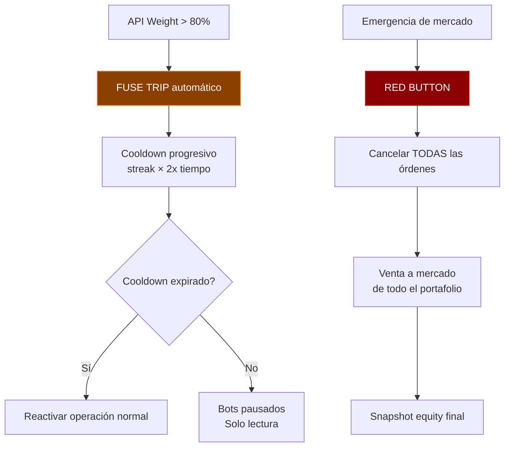
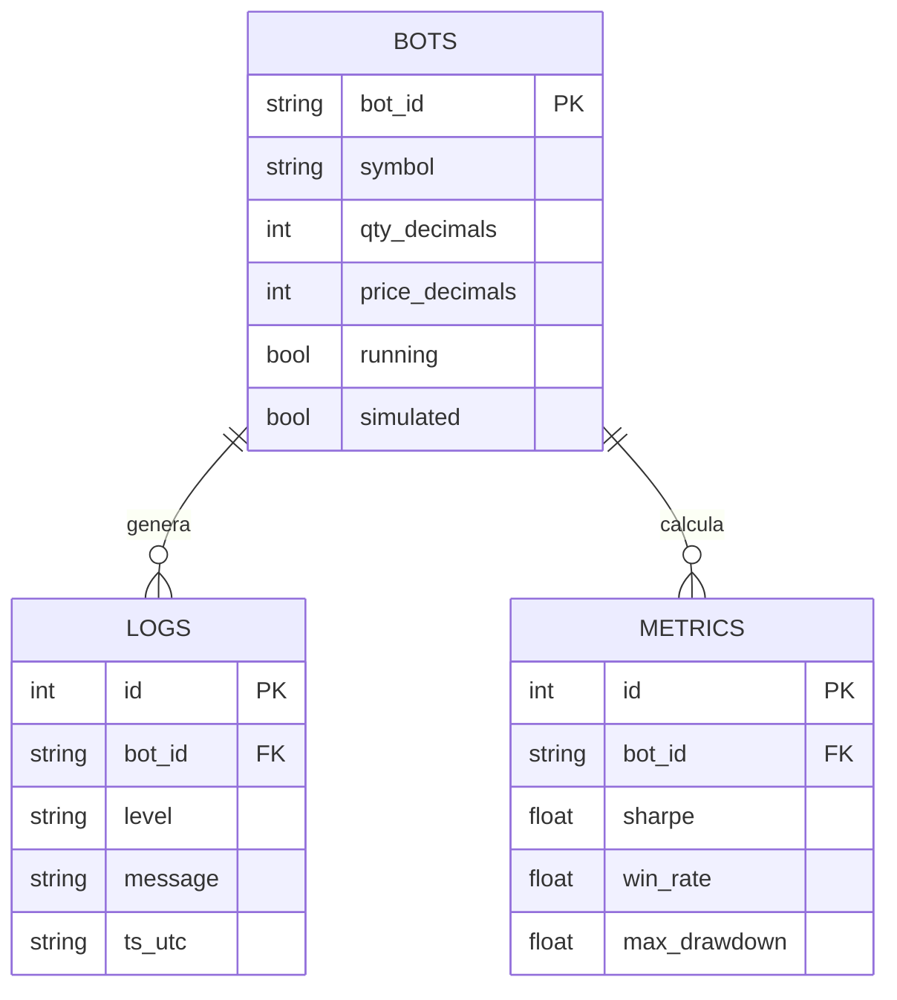

# 📘 Manual de Usuario — Pecunator L0 Ecosystem (v0.10.1)

## 1. Visión General

**Pecunator** es un sistema autónomo de gestión de capital diseñado para operar en Binance Spot con múltiples estrategias concurrentes. Opera bajo la filosofía **L0** (Nivel Cero): volumen nocional bajo, dispersión de capital, y beneficio mínimo garantizado por operación.

| Componente | Tecnología | Puerto | Función |
|---|---|---|---|
| **Motor (Backend)** | Python / FastAPI | `:8000` | Lógica de trading, gateway Binance, persistencia SQLite |
| **Hub (Frontend)** | Flutter Desktop (Windows) | N/A | Dashboard de control, monitoreo, configuración |
| **VMO Sensor** | Python + Gemini Flash | Integrado | Análisis visual de mercado vía capturas de gráficos |

```mermaid
graph TB
    subgraph Flutter["🖥️ Flutter Desktop Hub"]
        D[Dorothy Hub]
        M[Elphaba Hub]
        T[        MKT[Monitor Mercado]
        SPOT[Cuenta Spot]
        W[API Weight Monitor]
        MACRO[Macro Intelligence]
        SAND[API Sandbox]
    end
    subgraph Backend["⚙️ FastAPI Backend :8000"]
        GW[Gateway Binance]
        DB[(SQLite)]
        VMO[VMO Sensor]
        VAULT[Vault Credenciales]
        EVT[Market Events Engine]
        PREC[Symbol Precision]
    end
    Flutter -->|HTTP REST| Backend
    GW -->|WebSocket + REST| BIN[Binance API]
    EVT -->|24h Heatmap + Calendar| MACRO
    PREC -->|Auto qDec/pDec| D & M & T
```

---

## 2. Inicio Rápido

### 2.1 Levantar el Backend
```powershell
cd c:\Users\lexar\Desktop\Pecunator
python -m uvicorn "runtime.api.app:create_app" --factory --host 0.0.0.0 --port 8000
```

### 2.2 Levantar Flutter Desktop
```powershell
cd desktop_shell
# Opción A: Compilado
.\build\windows\x64\runner\Debug\pecunator_desktop.exe

# Opción B: Desarrollo (hot reload)
flutter run -d windows
```

### 2.3 Auto-Start del Gateway
Al abrir Flutter, el gateway Binance se inicia automáticamente:
1. Llama `POST /api/v1/gateway/start` con credenciales del vault
2. Sincroniza timestamp: `POST /api/v1/time/sync`
3. Si falla → icono nube muestra estado offline (operación manual posible)

> [!NOTE]
> El backend usa app factory: `runtime.api.app:create_app`. El comando `--factory` es obligatorio.

---

## 3. Navegación del Hub (10 páginas)

| Índice | Icono | Página | Función |
|---|---|---|---|
| 0 | 🏠 | **Dorothy Hub** | Control de bots DCA trend-following |
| 1 | 📊 | **Monitor Mercado** | Gráficos velas, orderbook, tickers real-time |
| 2 | 👛 | **Cuenta Spot** | Panel consolidado: equity, wallets, badges |
| 3 | 📚 | **Biblioteca** | VisionScraper, gestión activos referencia |
| 4 | 🧠 | **Elphaba Hub** | Bot breakout/range DCA multi-timeframe |
| 5 | 🕸️ | **| 6 | 💰 | **Earn** | Staking/earn history |
| 7 | 💱 | **Carry** | Operaciones carry trade |
| 8 | ⚖️ | **API Weight** | Oscilador peso API, crestas, fusible |
| 9 | 🌍 | **Macro Intelligence** | Heatmap 24h, calendario económico, F&G, geo |

### Utilidades (barra superior)
- 🔑 **API Keys** — Gestión de credenciales Binance
- ☁️ **Gateway ON/OFF** — Iniciar/detener conexión
- 🌗 **Tema día/noche** — Toggle visual
- 🌐 **Reloj Binance** — Hora servidor + resync
- 🔄 **Refrescar** — Recarga manual de datos

---

## 4. Flujo de Operación de un Bot

```mermaid
flowchart TD
    A[Crear bot en Flutter Hub] --> B{Gateway activo?}
    B -->|Sí| C[Auto-resolve qDec/pDec\ndesde exchangeInfo]
    B -->|No| C2[Usar defaults seguros\nqDec=8, pDec=4]
    C --> D[Bot creado en SQLite\nsimulated=true]
    C2 --> D
    D --> E[Activar bot: botón ACTIVO]
    E --> F{Ciclo perpetuo}
    F --> G[Evaluar mercado:\nticker + open orders]
    G --> H{Señal de compra?}
    H -->|Sí| I[Colocar orden BUY]
    H -->|No| J[Esperar loop_interval_sec]
    I --> K{Orden ejecutada?}
    K -->|Sí| L[Calcular precio SELL\n= buy_price × 1+profit]
    K -->|No| J
    L --> M[Colocar orden SELL LIMIT]
    M --> J
    J --> F
    
    style A fill:#1a1a2e,stroke:#00d4ff
    style D fill:#1a1a2e,stroke:#00ff88
    style I fill:#1a1a2e,stroke:#ffaa00
    style L fill:#1a1a2e,stroke:#00ff88
```



### Flujo de Seguridad (Fusible + RED BUTTON)



---

## 5. Tipos de Bot — Detalle Completo

### 5.1 Dorothy (DCA Trend-Following)
> **Filosofía**: Compra incremental durante caídas, vende con beneficio en recuperación.

| Parámetro | Descripción | Default L0 |
|---|---|---|
| `symbol` | Par spot (ej. XRPUSDT) | XRPUSDT |
| `loop_interval_sec` | Segundos entre ciclos | 450 |
| `quote_order_qty` | Monto USDT por compra | 7 |
| `profit_factor` | % beneficio (0.05 = 5%) | 0.05 |
| `margin_drop_factor` | Caída mínima para nueva compra | 0.004 |
| `max_drawdown_pct` | Drawdown máximo antes de bloquear | 0.20 |
| `stop_loss_pct` | Stop-loss por posición | 0.10 |
| `simulated` | Modo papel (no ejecuta en Binance) | true |

> [!NOTE]
> `qDec` y `pDec` son **auto-resueltos** desde Binance `exchangeInfo` (LOT_SIZE/PRICE_FILTER). Ya no se setean manualmente.

### 5.2 Elphaba (Breakout/Range DCA)
> **Filosofía**: DCA multi-timeframe con señal técnica de rupturas y rangos.

Parámetros adicionales: `base_asset`, `quote_asset`, timeframes W/H con periods, mm, margins.

### 5.3 > **Filosofía**: Compra cesta de 5 activos volátiles, cosecha 6%+ por ciclo en subidas generales.

| Parámetro | Default L0 |
|---|---|
| `symbols_csv` | PEPEUSDT,SUIUSDT,NEARUSDT,INJUSDT,FETUSDT |
| `profit_target_pct` | 0.06 (6%) |
| `factor_multiplication` | 0.94 |
| `quote_order_qty_modulo` | 6 USDT |

> [!IMPORTANT]
> Los símbolos de 
---

## 6. Páginas Dedicadas

### 6.1 API Weight Monitor (Índice 8)
Dashboard con oscilador de 5 minutos que monitorea consumo API:
- **Gauge radial** con % de uso real-time
- **Detección de crestas** (uso >60% sostenido)
- **Zonas horarias** de uso bajo → ventanas para operaciones intensivas
- **Recomendaciones** automáticas según nivel de uso
- **Estado del fusible** con streak y cooldown

### 6.2 Macro Intelligence (Índice 9)
Módulo de inteligencia macroeconómica:
- **Heatmap 24h**: Actividad de mercado por hora UTC con sesiones (Asia/Europa/US)
- **Calendario económico**: FOMC, CPI, NFP, ECB, BoJ — eventos high-impact
- **Fear & Greed Index**: Índice de sentimiento con tendencia 7 días
- **Riesgo geopolítico**: Factores activos con activos afectados

### 6.3 Panel Consolidado Spot (Índice 2)
Cockpit de alta densidad sin scroll:
- Líquido disponible / Bloqueado / Total equity
- Distribución por wallet (Spot/Futures/Earn/External)
- Equity actual vs promedio vs máximo histórico
- Badges de estado (Gateway, Trading, Fusible)

### 6.4 API Sandbox (dentro de Dorothy Hub)
Interfaz nativa Flutter (no browser) para consultas REST:
- Catálogo de endpoints disponibles
- Ejecución en vivo con JSON response viewer
- Curado automático con persistencia SQLite

---

## 7. VMO Sensor (Visual Market Observer)

Captura gráficos TradingView → análisis vía Gemini Flash:
- **Régimen**: tendencial, lateral, volátil
- **Bias**: bullish, bearish, neutral
- **Confianza**: 0-100%
- **Timeframes**: 4h, 1d
- Símbolos: todos los de Dorothy + Elphaba + 
---

## 8. Gestión de Credenciales

1. Click en 🔑 en la barra superior
2. Ingresa `API Key` y `API Secret` de Binance
3. El sistema las almacena en el vault local
4. Solo se necesita una credencial activa a la vez

> [!WARNING]
> Nunca compartas tus API keys. Usa permisos restrictivos en Binance: solo Spot Trading, sin retiros.

---

## 9. Herramientas de Protocolo (RED BUTTON)

> [!CAUTION]
> Estas herramientas ejecutan acciones irreversibles.

| Herramienta | Acción | Precauciones |
|---|---|---|
| **Protocolo Cierre** | Cancela órdenes LIMIT + snapshot equity | Detiene bots antes |
| **RED BUTTON** | Venta de emergencia a mercado | Puede fallar sin par directo |
| **Cleanup LIMIT** | Limpia solo LIMIT orders | No vende activos |
| **Cleanup STOP** | Limpia STOP huérfanas | No toca posiciones |
| **Cleanup TOTAL** | Cancela TODA orden abierta | Más agresivo |

---

## 10. Arquitectura de Datos

```
runtime/data/
├── pecunator.db                  # SQLite: bots, logs, métricas, sandbox curados
├── earn_history.db               # Historial earn/staking
├── paper_trades.sqlite           # Paper trading simulado
├── paper_trades_backup_v0.10.0   # Backup pre-refactor decimales
└── vmo_captures/                 # Capturas PNG del VMO por símbolo
```



---

## 11. Filosofía L0

- **Volumen nocional**: 5-8 USDT por operación
- **Beneficio mínimo**: ≥3% por operación (Dorothy/Elphaba), ≥6% por ciclo (- **Dispersión**: Capital repartido entre múltiples instrumentos NO correlacionados
- **Adaptativo**: Profit target ajustable según símbolo, volatilidad y capital
- **Fail-safe**: `simulated=true` por defecto; RED BUTTON disponible 24/7
- **Auto-precision**: qDec/pDec auto-resueltos desde Binance (v0.10.1+)

---

## 12. ❓ FAQ — Preguntas Frecuentes

### ¿Puedo correr Dorothy y **Sí**, pero con símbolos diferentes. Nunca dupliques el mismo par en dos bots — causa conflictos de órdenes.

### ¿Qué pasa si el backend se cae mientras un bot está activo?
Los bots se detienen automáticamente. Al reiniciar el backend, sus estados se restauran desde SQLite pero deben reactivarse manualmente desde Flutter.

### ¿Cómo sé si mis órdenes se ejecutaron en modo real?
Revisa los logs del bot en el Hub. Los logs muestran `[SIMULATED]` para paper trading y detalles de orden real para trading activo. Confirma en la app de Binance.

### ¿Cuánto API weight consume un bot típico?
~5-15 weight por ciclo (ticker + orderbook + balance). Con 3 bots a 300s = ~15 pts/min. Binance permite 6000/min, así que estás al 0.25%.

### ¿Puedo cambiar parámetros mientras un bot está corriendo?
**Sí**. Usa "Guardar y aplicar" — el bot se detiene, aplica cambios, y se reactiva automáticamente.

### ¿El sistema puede operar 24/7 sin supervisión?
Técnicamente sí, pero **no se recomienda** en L0. Revisa al menos 2x al día: equity, logs, y peso API.

### ¿Los decimales se ajustan solos ahora?
**Sí** (v0.10.1+). Al crear o guardar un bot, el sistema consulta `exchangeInfo` de Binance y auto-configura `qty_decimals` y `price_decimals`. Si el gateway está offline, usa defaults seguros.

### ¿Necesito internet constantemente?
Sí para operar. Sin internet, el gateway se desconecta y los bots quedan en pausa. Los datos históricos locales (SQLite) se mantienen.

---

## 13. 🚫 Lo que NUNCA debes hacer

> [!CAUTION]
> Violar estas reglas puede causar pérdida de capital o corrupción del sistema.

1. **NUNCA** operes en modo real (`simulated: false`) sin haber observado al menos 20 ciclos simulados exitosos
2. **NUNCA** uses el mismo símbolo en dos bots distintos — conflicto de órdenes asegurado
3. **NUNCA** subas `quote_order_qty` por encima del 10% de tu capital total — riesgo de concentración
4. **NUNCA** desactives `max_drawdown_pct` ni `stop_loss_pct` — son tu red de seguridad
5. **NUNCA** modifiques la DB SQLite manualmente — usa siempre la API REST
6. **NUNCA** compartas tus API keys ni las subas a Git — perderás tu capital
7. **NUNCA** ignores el fusible API (FUSE TRIP) — forzar operaciones puede causar ban temporal
8. **NUNCA** corras el backend con permisos de retiro en las API keys — solo Spot Trading
9. **NUNCA** confíes ciegamente en una señal del VMO — es probabilístico, no determinístico
10. **NUNCA** ejecutes RED BUTTON como test — es irreversible y vende todo a mercado

---

## 14. ✅ Lo que SIEMPRE debes hacer

> [!TIP]
> Estos hábitos protegen tu capital y mantienen el sistema sano.

1. **SIEMPRE** empieza con `simulated: true` — observa antes de arriesgar
2. **SIEMPRE** verifica el gateway (☁️ verde) antes de activar bots
3. **SIEMPRE** revisa logs después de cada ciclo las primeras 48 horas
4. **SIEMPRE** mantén backup de la DB antes de cambios mayores: `paper_trades_backup_*.sqlite`
5. **SIEMPRE** usa símbolos en MAYÚSCULAS (el sistema normaliza, pero es buena práctica)
6. **SIEMPRE** resincroniza el reloj Binance si ves errores de timestamp
7. **SIEMPRE** monitorea el API Weight — si estás >60%, reduce frecuencia de loops
8. **SIEMPRE** diversifica: mínimo 3 instrumentos no correlacionados
9. **SIEMPRE** revisa el calendario macroeconómico antes de activar bots — FOMC/CPI causan volatilidad extrema
10. **SIEMPRE** mantén el sistema actualizado: `git pull && flutter build windows`

---

## 15. Troubleshooting

| Problema | Causa probable | Solución |
|---|---|---|
| "No se pudo conectar al motor" | Backend apagado | Levantar backend en `:8000` con `--factory` |
| "Timestamp ahead/behind" | Desync de reloj | Click en reloj Binance para re-sincronizar |
| "Gateway OFF" | Sin credenciales o red caída | Verificar vault + red; click nube |
| "FUSE TRIP" | API weight excedido | Esperar cooldown automático |
| Caracteres rotos en UI | Encoding mojibake | Corregido en v0.9.1 |
| Build falla "CMake" | Cache VS antiguo | `flutter clean && flutter build windows` |
| qDec/pDec rechazado | Gateway offline al crear bot | Reiniciar gateway, re-guardar bot |
| Bot no compra | Saldo insuficiente o drop muy alto | Revisar equity y ajustar parameters |

---

## 16. Versiones y Tags

| Tag | Fecha | Highlights |
|---|---|---|
| `v0.10.1` | 2026-05-07 | Auto-resolve decimales, case-insensitive, 115 tests |
| `v0.10.0` | 2026-05-07 | Gateway auto-start, API Weight, Macro Intelligence, 40/40 integration |
| `v0.9.1` | 2026-05-06 | Fix encoding, port unification 8000, 76 Python tests |

---

> [!IMPORTANT]
> Este manual es la fuente de verdad para la operación de Pecunator. Ante dudas, consulta aquí antes de experimentar.
