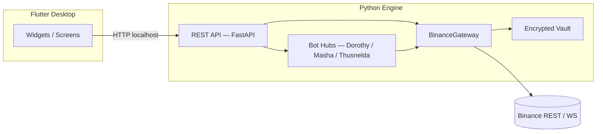

# Arquitectura — Pecunator

> Flutter Desktop + Motor Python. Sin dashboard web.  
> Referencia técnica del estado actual del sistema.

---

## Visión General

```
┌─────────────────────────────────────────────────────────┐
│              Flutter Desktop Shell                       │
│   (Widgets / Providers / Services / Screens)            │
└───────────────────────┬─────────────────────────────────┘
                        │ HTTP(S) localhost
┌───────────────────────▼─────────────────────────────────┐
│              Python Engine (FastAPI)                     │
│   runtime/api/  →  runtime/connectors/  →  Binance       │
│   runtime/core/ (vault, state, settings, audit)          │
│   runtime/modules/ (bots, tools)                         │
└─────────────────────────────────────────────────────────┘
```

El motor Python corre en `http://127.0.0.1:8765` por defecto.  
Flutter **solo** habla con el motor vía loopback HTTP; nunca tiene API keys en Dart.

---

## Componentes Principales

### 1. Motor Python (`runtime/`)

| Subcarpeta | Responsabilidad |
|------------|----------------|
| `runtime/main.py` | Entrypoint del engine: startup, servidor API |
| `runtime/api/` | Façade FastAPI: rutas, schemas, orquestación de servicios |
| `runtime/connectors/` | Gateway Binance — polling de cuenta, market streams, equity, REST weight |
| `runtime/core/` | Primitivas compartidas: vault, settings, state store, audit stores, equity math |
| `runtime/modules/bots/` | Módulos de estrategia de bots (Dorothy, Masha, Thusnelda) |
| `runtime/modules/tools/` | Módulos de herramientas operativas (ops, sandbox, rest-weight) |
| `runtime/bot/` | Puente de compatibilidad para imports legacy (deprecado gradualmente) |

**Arranque:**
```bash
python main.py          # bootstrap → runtime/main.py
python -m runtime       # arranque como paquete
```

**Variables de entorno clave:**

| Variable | Default | Descripción |
|----------|---------|-------------|
| `PECUNATOR_API_HOST` | `127.0.0.1` | Host de la API |
| `PECUNATOR_API_PORT` | `8765` | Puerto de la API |
| `PECUNATOR_API_WEIGHT_LIMIT_1M` | `6000` | Límite de referencia de peso REST |
| `PECUNATOR_BINANCE_API_KEY` | — | API key de Binance (alternativa al vault) |
| `PECUNATOR_BINANCE_API_SECRET` | — | API secret de Binance (alternativa al vault) |
| `PECUNATOR_EQUITY_BASE_ASSET` | `USDT` | Activo base para cálculo de equity |
| `PECUNATOR_EQUITY_AVG_WINDOW` | `6` | Ventana de promedio para equity rolling |
| `PECUNATOR_EQUITY_POLL_STRIDE` | `5` | Cada cuántos ciclos refrescar equity |
| `PECUNATOR_ENGINE_STUB` | — | Si `=1`, arranca en modo stub sin servidor |

### 2. Flutter Desktop Shell (`desktop_shell/`)

| Subcarpeta | Responsabilidad |
|------------|----------------|
| `lib/config/app_config.dart` | Configuración centralizada |
| `lib/providers/app_providers.dart` | Estado global vía Riverpod |
| `lib/services/` | HTTP client, exceptions, preferences |
| `lib/screens/` | Pantallas: home, bots, spot account |
| `lib/widgets/` | Widgets reutilizables: error display, logs viewer, gateway status |
| `lib/utils/` | Helpers: formateadores de números |
| `lib/api_client.dart` | Cliente HTTP del motor |
| `lib/main.dart` | Entry point de la UI |

**Pantallas principales:**
- **Dorothy Hub** — gestión de instancias Dorothy
- **Masha Hub** — gestión de instancias Masha
- **Thusnelda Hub** — gestión de instancias Thusnelda
- **Spot Account** — equity, wallets y monitor de peso REST
- **Sandbox** — queries guiadas a Binance
- **Vault** — gestión de credenciales

### 3. Vault de Credenciales

- Ubicación: `runtime/data/credentials.enc`
- Cifrado: **Fernet** (AES 128-CBC + HMAC-SHA256) con clave en `runtime/data/vault_local.key`
- Gestión: desde la UI Flutter (add/delete con auto-activación) o por variables de entorno
- **Regla:** una sola fuente activa por sesión para evitar mezclar cuentas

### 4. Persistencia SQLite

| Base | Tablas principales |
|------|-------------------|
| `runtime/data/dorothy_hub.sqlite` | `dorothy_instances`, `dorothy_logs`, `dorothy_runtime_state`, `dorothy_equity_snapshots`, `dorothy_metrics_log` |
| `runtime/data/masha_hub.sqlite` | `masha_runtime_state`, `masha_equity_snapshots`, `masha_metrics_log` |
| `runtime/data/thusnelda_hub.sqlite` | `thusnelda_runtime_state`, `thusnelda_equity_snapshots`, `thusnelda_metrics_log` |
| `runtime/data/ops_audit.sqlite` | Trazabilidad de protocolos operativos |

---

## Doctrina Operativa

- **Objetivo de trading:** componer beneficio a lo largo de ciclos repetidos
- **Las pérdidas no se prohíben;** se contienen, auditan y aprenden con controles estrictos
- Toda ruta de operación (loops de bots, protocolos de limpieza, botón rojo, lecturas de cuenta) prioriza:
  - Inputs determinísticos (credencial activa + base asset)
  - Corrección de timestamp contra servidor Binance
  - Trazabilidad en logs SQLite y registros de auditoría

---

## Mecanismo de Inmortalidad (Hub Dorothy)

- Las instancias del hub se persisten en SQLite con su **estado deseado** (`desired_running`)
- Si una instancia estaba marcada para correr, el motor intenta **reanudarla automáticamente** al iniciar y cuando detecta caídas
- Dorothy aplica **reintentos con backoff** y recrea cliente para recuperar sesión de red
- Para retomar trabajo tras reinicio de Windows:
  ```powershell
  powershell -ExecutionPolicy Bypass -File scripts/engine/InstallImmortalStartup.ps1
  ```

---

## Diagrama de flujo simplificado



---

## Fases de Migración

| Fase | Estado | Descripción |
|------|--------|-------------|
| 0 | ✅ | Web stack removido; Flutter + engine API es el plan |
| 1 | ✅ | Flutter SDK; `init_flutter_desktop.ps1` → `desktop_shell/` |
| 2 | ✅ | FastAPI façade en `runtime/api/` conectado con Flutter HTTP client |
| 3 | ✅ | Pantallas Flutter integradas para vault, instancias de hub y logs |

---

## Convención de Código

- Python: type hints en funciones públicas, docstrings en clases
- Anti-NaN guards en toda operación con `Decimal`
- `sanitize_log_message()` en toda salida de log
- No bare `except:` — siempre especificar tipo de excepción
- Imports agrupados: stdlib → third party → local
