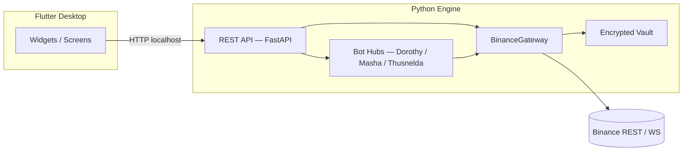

# Architecture — Pecunator

> Flutter Desktop + Python Engine. No web dashboard.  
> Technical reference of the current state of the system.

---

## Overview

```
┌─────────────────────────────────────────────────────────┐
│              Flutter Desktop Shell                       │
│   (Widgets / Providers / Services / Screens)            │
└───────────────────────┬─────────────────────────────────┘
                        │ HTTP(S) localhost
┌───────────────────────▼─────────────────────────────────┐
│              Python Engine (FastAPI)                     │
│   runtime/api/  →  runtime/connectors/  →  Binance       │
│   runtime/core/ (vault, state, settings, audit)          │
│   runtime/modules/ (bots, tools)                         │
└─────────────────────────────────────────────────────────┘
```

The Python engine runs on `http://127.0.0.1:8765` by default.  
Flutter **only** talks to the engine via HTTP loopback; you never have API keys in Dart.

---

## Main Components

### 1. Python engine (`runtime/`)

| Subfolder | Responsibility |
|------------|----------------|
| `runtime/main.py` | Engine entrypoint: startup, API server |
| `runtime/api/` | Façade FastAPI: routes, schemas, service orchestration |
| `runtime/connectors/` | Gateway Binance — account polling, market streams, equity, REST weight |
| `runtime/core/` | Shared primitives: vault, settings, state store, audit stores, equity math |
| `runtime/modules/bots/` | Bot Strategy Modules (Dorothy, Masha, Thusnelda) |
| `runtime/modules/tools/` | Operational tools modules (ops, sandbox, rest-weight) |
| `runtime/bot/` | Compatibility bridge for legacy imports (gradually deprecated) |

**Start:**
```bash
python main.py # bootstrap → runtime/main.py
python -m runtime # boot as package
```

**Key environment variables:**

| Variable | Default | Description |
|----------|---------|-------------|
| `PECUNATOR_API_HOST` | `127.0.0.1` | API Host |
| `PECUNATOR_API_PORT` | `8765` | API Port |
| `PECUNATOR_API_WEIGHT_LIMIT_1M` | `6000` | REST Weight Reference Limit |
| `PECUNATOR_BINANCE_API_KEY` | — | Binance API key (alternative to vault) |
| `PECUNATOR_BINANCE_API_SECRET` | — | Binance secret API (alternative to vault) |
| `PECUNATOR_EQUITY_BASE_ASSET` | `USDT` | Base asset for equity calculation |
| `PECUNATOR_EQUITY_AVG_WINDOW` | `6` | Average window for equity rolling |
| `PECUNATOR_EQUITY_POLL_STRIDE` | `5` | How many cycles to refresh equity |
| `PECUNATOR_ENGINE_STUB` | — | If `=1`, boot in serverless stub mode |

### 2. Flutter Desktop Shell (`desktop_shell/`)

| Subfolder | Responsibility |
|------------|----------------|
| `lib/config/app_config.dart` | Centralized configuration |
| `lib/providers/app_providers.dart` | Global status via Riverpod |
| `lib/services/` | HTTP client, exceptions, preferences |
| `lib/screens/` | Screens: home, bots, spot account |
| `lib/widgets/` | Reusable widgets: error display, logs viewer, gateway status |
| `lib/utils/` | Helpers: number formatters |
| `lib/api_client.dart` | Engine HTTP Client |
| `lib/main.dart` | UI entry point |

**Main screens:**
- **Dorothy Hub** — Dorothy instance management
- **Masha Hub** — Masha instance management
- **Thusnelda Hub** — Thusnelda instance management
- **Spot Account** — equity, wallets and REST weight monitor
- **Sandbox** — queries guided to Binance
- **Vault** — credential management

### 3. Credential Vault

- Location: `runtime/data/credentials.enc`
- Encryption: **Fernet** (AES 128-CBC + HMAC-SHA256) with key in `runtime/data/vault_local.key`
- Management: from the Flutter UI (add/delete with auto-activation) or by environment variables
- **Rule:** only one active source per session to avoid mixing accounts

### 4. SQLite persistence

| Base | Main tables |
|------|-----|
| `runtime/data/dorothy_hub.sqlite` | `dorothy_instances`, `dorothy_logs`, `dorothy_runtime_state`, `dorothy_equity_snapshots`, `dorothy_metrics_log` |
| `runtime/data/masha_hub.sqlite` | `masha_runtime_state`, `masha_equity_snapshots`, `masha_metrics_log` |
| `runtime/data/thusnelda_hub.sqlite` | `thusnelda_runtime_state`, `thusnelda_equity_snapshots`, `thusnelda_metrics_log` |
| `runtime/data/ops_audit.sqlite` | Traceability of operational protocols |

---

## Operational Doctrine

- **Trading objective:** to make profit over repeated cycles
- **Losses are not prohibited;** they are contained, audited and learned with strict controls
- Every operation route (bot loops, cleaning protocols, red button, account readings) prioritizes:
  - Deterministic inputs (active credential + base asset)
  - Timestamp fix against Binance server
  - Traceability in SQLite logs and audit logs

---

## Immortality Mechanism (Hub Dorothy)

- Hub instances are persisted in SQLite with their **desired state** (`desired_running`)
- If an instance was marked to run, the engine attempts to **automatically resume it** upon startup and when it detects crashes
- Dorothy applies **retries with backoff** and recreates client to recover network session
- To resume work after restarting Windows:
  ``powershell
  powershell -ExecutionPolicy Bypass -File scripts/engine/InstallImmortalStartup.ps1
  ```

---

## Simplified flowchart



---

## Migration Phases

| Phase | Status | Description |
|------|--------|-------------|
| 0 | ✅ | Web stack removed; Flutter + engine API is the plan |
| 1 | ✅ | Flutter SDK; `init_flutter_desktop.ps1` → `desktop_shell/` |
| 2 | ✅ | FastAPI façade in `runtime/api/` connected with Flutter HTTP client |
| 3 | ✅ | Integrated Flutter screens for vault, hub instances and logs |

---

## Code Convention

- Python: type hints in public functions, docstrings in classes
- Anti-NaN guards on all operations with `Decimal`
- `sanitize_log_message()` on all log output
- No bare `except:` — always specify exception type
- Grouped imports: stdlib → third party → local