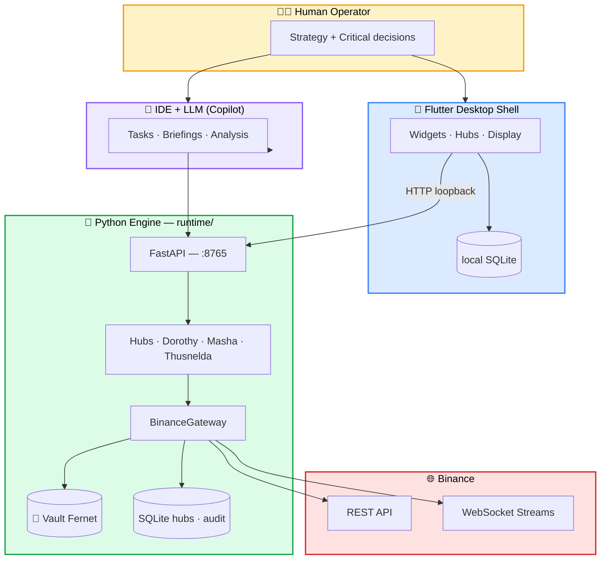

<div align="center">

# 💰 Pecunator — Official Wiki

### *Algorithmic financial operations hub for the sovereign operator*


---

> 🧭 **«Compose profit. Contain losses. Maintain sovereignty. Plot everything.»**

</div>

---

## 🎯 What is Pecunator?

**Pecunator** *(from Latin* pecunia *—wealth, minted money)* is a **personal financial workstation** designed for a single operator. It is not an exchange, it is not a fund, it is not a SaaS: it is a **local runtime** that combines:

| 🧩 Component | 🛠️ Technology | 🎯Role |
|--------|--------|--------|
| 🐍 **Engine** | Python · FastAPI · python-binance | Bot logic, vault, Binance connection |
| 🦋 **UI** | Flutter Desktop (Windows) | Dashboard, control, visualization |
| 🗄️ **Persistence** | SQLite + CSV + Vault Fernet | Status, metrics, encrypted credentials |
| 🤖 **Bots** | Dorothy · Masha · Thusnelda | Autonomous spot strategies |
| 🧠 **LLM/IDE** | Copilot · Operational tasks | Analysis, briefings, runbooks |

The philosophy is direct: **the human operator is sovereign**; the code executes what the operator authorizes; no strategic decision is blindly delegated to an algorithm.

---

## 🗺️ Wiki Map

<table>
<tr>
<td width="33%" valign="top">

### 🏛️ Basics
- 📜 **[Manifesto](Manifesto)**  
  Philosophy, 4 pillars, doctrine
- 🏗️ **[Architecture](Arquitectura)**  
  Flutter + Python, boundaries
- 🗂️ **[Module Map](Mapa-de-Modulos)**  
  Complete repo structure

</td>
<td width="33%" valign="top">

### ⚙️ Operation
- 🚀 **[Installation and Startup](Instalacion-y-Arranque)**  
  Step by step setup
- 🔌 **[API Surface](API-Surface)**  
  Complete REST reference
- 🚨 **[Operational Protocols](Protocolos-Operativos)**  
  Red button, runbooks

</td>
<td width="33%" valign="top">

### 🤖 Bots
- 🎯 **[Bot Dorothy](Bot-Dorothy)**  
  spot ladder
- 📊 **[Bot Masha](Bot-Masha)**  
  multi-timeframe DCA
- 🌐 **[Bot Thusnelda](Bot-Thusnelda)**  
  Symbol basket

</td>
</tr>
<tr>
<td width="33%" valign="top">

### 🔒Security
- 🔐 **[Security and Credentials](Seguridad-y-Credenciales)**  
  Vault Fernet, rotation

</td>
<td width="33%" valign="top">

### 📡 Compliance
- ⚖️ **[Binance — Limits](Binance-Limites-y-Cumplimiento)**  
  Rate limits REST/WS

</td>
<td width="33%" valign="top">

### 🧪 Development
- 🛠️ **[Development Guide](Guia-de-Desarrollo)**  
  Git, tests, CI/CD
- 🔑 **[Wiki Token Permission](Permiso-Wiki-Token)**  
  Give the agent write permissions
- 📝 **[Changelog](Changelog)**  
  Change history

</td>
</tr>
</table>

---

## 🏗️ Architecture in an image



---

## 🌟 The 4 Pillars (visual version)

<table>
<tr>
<td width="25%" align="center" bgcolor="#FFF8DC">

### 🟡 Pillar I
**Binance CEX**  
*Execution and custody*

Infrastructure, not product.  
Provides orders, data, custody.

</td>
<td width="25%" align="center">

### 🟢 Pillar II
**GitHub Repo**  
*Knowledge and doctrine*

The mind of the project.  
Version code + policies.

</td>
<td width="25%" align="center">

### 🔵 Pillar III
**Flutter Shell**  
*Display and DB*

Bot Hub + Backup DB  
+ analysis laboratory.

</td>
<td width="25%" align="center">

### 🟣 Pillar IV
**IDE + LLM**  
*Operating brain*

Analysis and orchestration.  
**Proposes**, not decide.

</td>
</tr>
</table>

---

## 🚀 Quick Start

```bash
#🐍 1) Python Engine
pip install -r requirements.txt
python main.py
# → API at http://127.0.0.1:8765
# → OpenAPI docs at http://127.0.0.1:8765/docs

#🦋2) Flutter UI (Windows)
cd desktop_shell
flutter pub get
flutter run -d windows

#⚡ 3) Desktop Shortcut
powershell -ExecutionPolicy Bypass -File scripts/ui/InstallDesktopShortcut.ps1
```

> 📘 Complete guide: **[Installation and Startup](Instalacion-y-Arranque)**

---

## 🤖 The Three Bots — Quick Comparison

| | 🎯 **Dorothy** | 📊 **Masha** | 🌐 **Thusnelda** |
|---|:---:|:---:|:---:|
| **Symbols** | 1 (single pair) | 1 (single pair) | N (CSV basket) |
| **Strategy** | SELL LIMIT ladder + dip buy | DCA with technical signal `1w` + `1h` | Buy by historical average vs price |
| **Output** | SELL LIMIT per step | SELL LIMIT consolidated DCA | Global equity goal |
| **Inspiration** | Classic grid trading | DCA + Trend filter | Index averaging |
| **Manual** | [📖](Bot-Dorothy) | [📖](Bot-Masha) | [📖](Bot-Thusnelda) |
| **SQLite** | `dorothy_hub.sqlite` | `masha_hub.sqlite` | `thusnelda_hub.sqlite` |

They all share **3 uniform protections** (drawdown guard, configurable stop-loss, persisted Sharpe/win-rate/MDD metrics).

---

## 🧭 Doctrine in 6 Lines

> 1. 🏆 **Compound profit** — the goal is compound growth, not one-time bets.
> 2. 🛡️ **Contain losses** — not prohibited; they contain, audit and learn.
> 3. 👑 **Operational sovereignty** — the operator retains absolute control over funds and data.
> 4. 🔍 **Full traceability** — each operation is recorded and auditable.
> 5. 🤖 **The LLM proposes, the code disposes** — the AI ​​​​analyzes; execution is deterministic.
> 6. 🔐 **Least privilege** — keys only with strictly necessary permissions; never *withdraw*.

---

## 📚 Bibliography and References

> Pecunator does not invent the wheel. It is built on decades of literature on systematic trading, risk management, resilient software engineering, applied cryptography, and trader-centric product design. This section is the **canon of inspirations** of the project.

### 🧮 Systematic trading and quantitative strategies

| 📖 Work | 👤 Author(s) | 🔗 Link with Pecunator |
|---------|-------------|--------------------------|
| *Quantitative Trading: How to Build Your Own Algorithmic Trading Business* (2009) | **Ernest P. Chan** | Philosophy of autonomous bots with fixed parameters and disciplined backtesting. [Wiley](https://www.wiley.com/en-us/Quantitative+Trading%3A+How+to+Build+Your+Own+Algorithmic+Trading+Business-p-9780470284889) |
| *Algorithmic Trading: Winning Strategies and Their Rationale* (2013) | **Ernest P. Chan** | Mean-reversion and momentum frameworks applied in `runtime/modules/bots/`. |
| *Advances in Financial Machine Learning* (2018) | **Marcos López de Prado** | Robust metrics (Sharpe deflated, PBO), overfitting management, walk-forward. [Wiley](https://www.wiley.com/en-us/Advances+in+Financial+Machine+Learning-p-9781119482086) |
| *Trading Systems and Methods* (6th ed., 2019) | **Perry J. Kaufman** | Catalog of multi-timeframe technical filters — conceptual basis of **Masha**. |
| *Technical Analysis of the Financial Markets* (1999) | **John J. Murphy** | Concepts of moving averages and support/resistance used by the `1w`+`1h` signal. |
| *A Random Walk Down Wall Street* (1973…) | **Burton G. Malkiel** | **DCA** academic foundation that inspires Masha and Thusnelda. |
| *The Intelligent Investor* (1949) | **Benjamin Graham** | Concept of *margin of safety* applied to Dorothy's `margin_drop_factor`. |

### 📐 Risk management and financial mathematics

| 🧠Concept | 🧾Origin | 📍Where does it appear in Pecunator |
|------------|----------|----------------------------|
| **Sharpe Ratio** | William F. Sharpe (1966), *"Mutual Fund Performance"*, *Journal of Business* | Calculated per instance in `*_metrics_log` every `metrics_interval_cycles` |
| **Kelly Criterion** | J. L. Kelly Jr. (1956), *"A New Interpretation of Information Rate"*, *Bell System Tech. J.* — [Classic PDF](https://www.princeton.edu/~wbialek/rome/refs/kelly_56.pdf) | Mental framework for sizing `quote_order_qty` vs total equity |
| **Maximum Drawdown (MDD)** | Magdon-Ismail & Atiya (2004), *"Maximum Drawdown"*, *Risk Magazine* | `max_drawdown_pct` → state `WAIT_DRAWDOWN_GUARD` |
| **Volatility clustering** | Mandelbrot (1963), *"The Variation of Certain Speculative Prices"* | Justifies `loop_interval_sec` adaptive and backoff |
| **VaR / Expected Shortfall** | Artzner, Delbaen, Eber, Heath (1999), *"Coherent Measures of Risk"* | Future roadmap for health-factor lending |
| **Antifragility** | Nassim N. Taleb, *Antifragile* (2012) | Treating losses as information, not failure |

### 🏗️ Software engineering and architecture

| 📖 Work | 👤 Author(s) | 🔗 Link |
|---------|-------------|-----------|
| *Domain-Driven Design* (2003) | **Eric Evans** | Separation `runtime/modules/bots/` ↔ `runtime/modules/tools/` ↔ `runtime/api/` |
| *Clean Architecture* (2017) | **Robert C. Martin** | Boundary `main.py` ⇄ `runtime/` documented in [`main-runtime-boundary.md`](https://github.com/CuevazaArt/Pecunator/blob/main/docs/main-runtime-boundary.md) |
| *Release It!* (2nd ed., 2018) | **Michael T. Nygard** | Patterns **Circuit Breaker** (`ApiFuse`), **Bulkhead** (subaccounts) and **Timeout** |
| *Site Reliability Engineering* (2016) | **Google · Beyer, Jones, Petoff, Murphy** — [📚 free book](https://sre.google/sre-book/table-of-contents/) | Dorothy hub **immortality** mechanism (supervisor + retry + backoff) |
| *The Pragmatic Programmer* (1999/2019) | **Hunt & Thomas** | Sanitized registry and *broken windows* conventions in docs |
| *Designing Data-Intensive Applications* (2017) | **Martin Kleppmann** | Persistence model: Local SQLite as *working replica*, Binance as *source of truth* |
| *Continuous Delivery* (2010) | **Humble & Farley** | Workflows in `.github/workflows/` (tests + secret scan in each push) |

### 🔐 Cryptography and security

| 📋Standard/Resource | 🔗 Link | 📍Application |
|-----------------------|----------|---------------|
| **Fernet (symmetric encryption)** | [cryptography.io · Fernet spec](https://cryptography.io/en/latest/fernet/) | Vault encryption `credentials.enc` |
| **NIST SP 800-57** — Key Management | [NIST publication](https://csrc.nist.gov/publications/detail/sp/800-57-part-1/rev-5/final) | Rotation policy every 90 days |
| **OWASP Cryptographic Storage Cheat Sheet** | [OWASP](https://cheatsheetseries.owasp.org/cheatsheets/Cryptographic_Storage_Cheat_Sheet.html) | Encryption Guidelines at Rest |
| **CWE-798** — Use of Hard-coded Credentials | [MITRE](https://cwe.mitre.org/data/definitions/798.html) | Reason for *secret-scan* (Gitleaks) in CI |
| **Principle of Least Privilege** | Saltzer & Schroeder (1975), *"The Protection of Information in Computer Systems"* — [PDF](https://web.mit.edu/Saltzer/www/publications/protection/) | Bot API keys: trade yes, withdraw no |
| **Twelve-Factor App** | [12factor.net](https://12factor.net/) | Configuration by env vars (`PECUNATOR_*`) |

### 🌐 Stack APIs and libraries

| 🧰 Resource | 🔗Official documentation |
|--------|------------------------|
| 🟡 **Binance Spot API** (REST) ​​| [developers.binance.com — REST](https://developers.binance.com/docs/binance-spot-api-docs/rest-api) |
| 🟡 **Binance WebSocket Streams** | [github.com/binance/binance-spot-api-docs](https://github.com/binance/binance-spot-api-docs/blob/master/web-socket-streams.md) |
| 🟡 **Binance API FAQ** (rate limits, WAF, bans) | [Binance Support FAQ](https://www.binance.com/en/support/faq/detail/360004492232) |
| 🐍 **python-binance** | [python-binance.readthedocs.io](https://python-binance.readthedocs.io/) |
| ⚡ **FastAPI** | [fastapi.tiangolo.com](https://fastapi.tiangolo.com/) |
| 🦋 **Flutter Desktop** | [docs.flutter.dev/desktop](https://docs.flutter.dev/desktop) |
| 🪶 **Riverpod** (state mgmt) | [riverpod.dev](https://riverpod.dev/) |
| 🗄️ **SQLite** | [sqlite.org/docs.html](https://www.sqlite.org/docs.html) |
| 🔍 **Gitleaks** (CI secret scan) | [github.com/gitleaks/gitleaks](https://github.com/gitleaks/gitleaks) |
| 🔄 **CCXT** (multi-exchange — roadmap) | [docs.ccxt.com](https://docs.ccxt.com/) |

### 📊 Market and product concepts

| 🪙Concept | 📚 Introductory reference |
|------------|----------------------------|
| **Dollar-Cost Averaging (DCA)** | [Investopedia · DCA](https://www.investopedia.com/terms/d/dollarcostaveraging.asp) |
| **Grid trading / Ladder strategy** | [Investopedia · Grid Trading](https://www.investopedia.com/articles/forex/06/gridtrading.asp) |
| **Spot trading** | [Binance Academy · Spot Trading](https://academy.binance.com/en/articles/what-is-spot-trading) |
| **Order book microstructure** | Foucault, Pagano & Röell, *Market Liquidity* (2013) |
| **Health Factor (lending)** | [Aave Docs · HF](https://docs.aave.com/faq/borrowing#what-is-the-health-factor) (conceptual model also applied in Binance Loans) |
| **Maker-Taker fees** | [Binance · Trading Fees](https://www.binance.com/en/fee/schedule) |

### 🎓 Recommended courses and community

- 🎓 [QuantConnect Bootcamp](https://www.quantconnect.com/learning/articles) — fundamentals of algo trading (free).
- 🎓 [Hudson & Thames — Mlfinlab Tutorials](https://hudsonthames.org/) — Python implementations of López de Prado's book.
- 🎓 [MIT OCW · 18.S096 *Topics in Mathematics with Applications in Finance*](https://ocw.mit.edu/courses/18-s096-topics-in-mathematics-with-applications-in-finance-fall-2013/).
- 🎓 [Stanford CS229 · Machine Learning](https://cs229.stanford.edu/) — basis for future ML features.
- 💬 [r/algotrading](https://www.reddit.com/r/algotrading/) — practical community.

---

## 🧬 Express Glossary

| 🔤 Term | 📝 Meaning in Pecunator |
|-----------|----------------------------|
| **Hub** | Central runtime that orchestrates N instances of the same bot |
| **Gateway** | Connector against a specific exchange (today Binance; tomorrow CCXT) |
| **Vault** | Fernet encrypted store of credentials (`runtime/data/credentials.enc`) |
| **Fuse** | *Circuit breaker* that cuts REST if the weight exceeds thresholds |
| **Governor** | Smooth cadence regulation to avoid saturating the rate limit |
| **Coordinator** | Bot Lifecycle Orchestrator (start/stop/desired_running) |
| **Shell** | The Flutter Desktop frontend |
| **Doctrine** | Set of policies written in `docs/` that govern the operation |
| **Task** | Runbook executable by the LLM (`tools/ops-protocols/tasks/*.md`) |
| **Equity Rolling Window** | Moving average equity in `PECUNATOR_EQUITY_AVG_WINDOW` cycles |
| **Drawdown Guard** | State that suspends purchases if MDD exceeds `max_drawdown_pct` |
| **Red Button** | Endpoint `/api/v1/ops/red_button` that stops all bots |
| **Immortality** | Mechanism that resumes bots with `desired_running=true` after any crash |

---

## 🌍Language Convention

| 📍 Context | 🗣️Language |
|------------|-----------|
| **Wiki, documentation, coordination, chat, manuals** | 🇬🇧 **English** |
| Code source, identifiers, commits, logs | 🇬🇧 **English** |
| API responses (JSON keys, error messages) | 🇬🇧 **English** |

> **PROJECT DIRECTIVE**: The wiki must ALWAYS be in English. Any existing Spanish text must be translated to English. This ensures consistency and compatibility with global libraries, standard tools, and LLM processing context. All tests are run in GitHub Actions.

---

## 🛣️ Visual Roadmap


---

## 📞 How to navigate this wiki

<table>
<tr>
<td width="33%" align="center">

### 🆕 First time?
1. 📜 [Manifesto](Manifesto)
2. 🏗️ [Architecture](Arquitectura)
3. 🚀 [Installation](Instalacion-y-Arranque)

</td>
<td width="33%" align="center">

### ⚙️ Are you going to operate?
1. 🚀 [Installation](Instalacion-y-Arranque)
2. 🤖 [Bot Dorothy](Bot-Dorothy) (simpler)
3. 🚨 [Protocols](Protocolos-Operativos)

</td>
<td width="33%" align="center">

### 🛠️ Are you going to contribute?
1. 🗂️ [Module Map](Mapa-de-Modulos)
2. 🛠️ [Development Guide](Guia-de-Desarrollo)
3. 🔌 [API Surface](API-Surface)

</td>
</tr>
</table>

---

<div align="center">

### 🌟 *«Pecunia non olet, be discipline yes it remains.»*

**[⬆️ Back to top](#-pecunator--official-wiki)** · **[📜 Manifesto](Manifesto)** · **[🚀 Get Started](Instalacion-y-Arranque)** · **[🔌 API](API-Surface)**

<sub>📌 Home last update: 2026-05-05 · 🌐 Repo: [github.com/CuevazaArt/Pecunator](https://github.com/CuevazaArt/Pecunator)</sub>

</div>