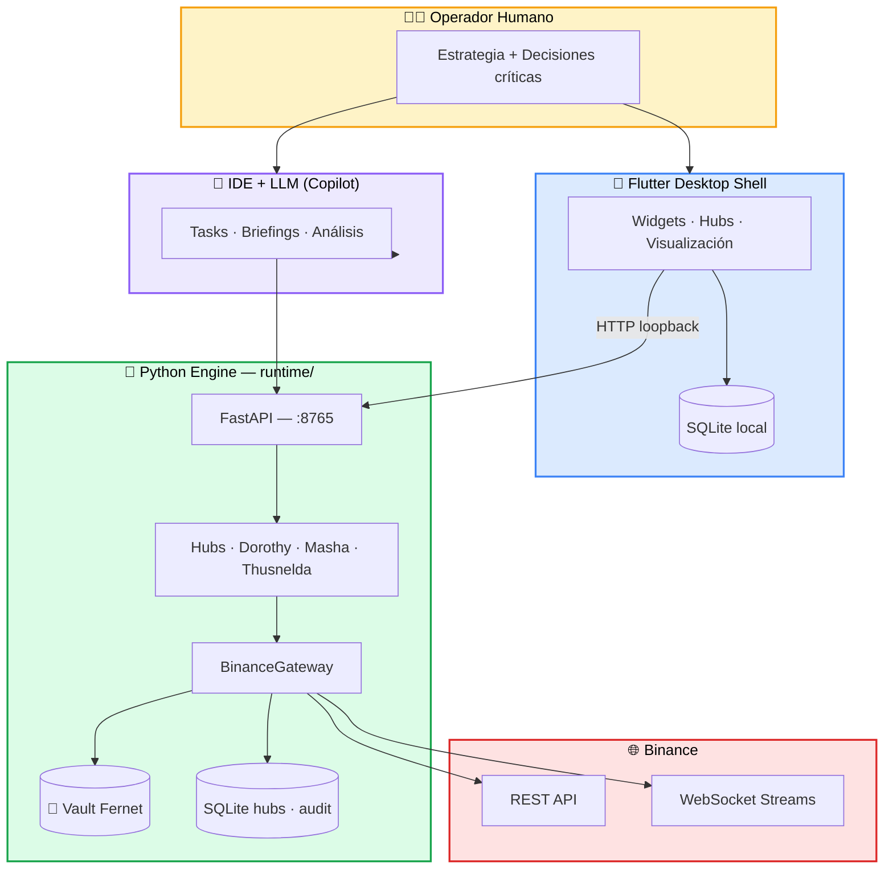
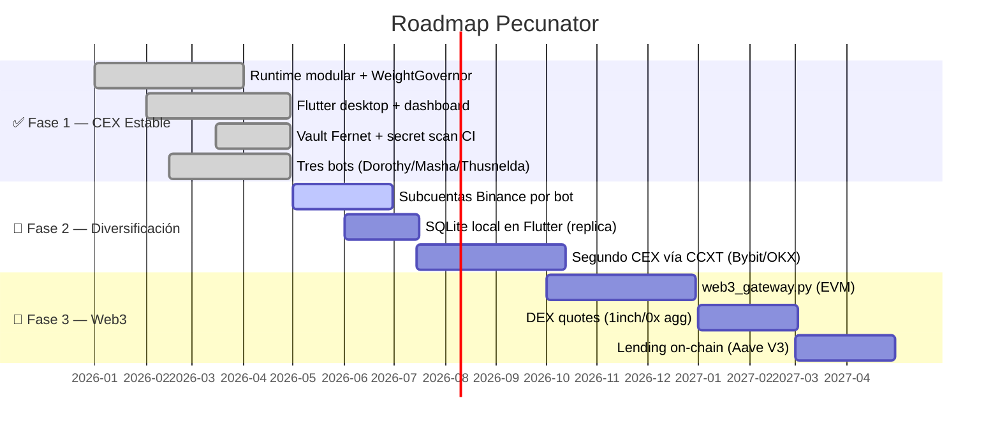

<div align="center">

# 💰 Pecunator — Wiki Oficial

### *Hub de operaciones financieras algorítmicas para el operador soberano*


---

> 🧭 **«Componer beneficio. Contener pérdidas. Mantener soberanía. Trazar todo.»**

</div>

---

## 🎯 ¿Qué es Pecunator?

**Pecunator** *(del latín* pecunia *— riqueza, dinero acuñado)* es una **estación de trabajo financiera personal** diseñada para un único operador. No es un exchange, no es un fondo, no es un SaaS: es un **runtime local** que combina:

| 🧩 Componente | 🛠️ Tecnología | 🎯 Rol |
|---------------|---------------|--------|
| 🐍 **Motor** | Python · FastAPI · python-binance | Lógica de bots, vault, conexión Binance |
| 🦋 **UI** | Flutter Desktop (Windows) | Dashboard, control, visualización |
| 🗄️ **Persistencia** | SQLite + CSV + Vault Fernet | Estado, métricas, credenciales cifradas |
| 🤖 **Bots** | Dorothy · Masha · Thusnelda | Estrategias spot autónomas |
| 🧠 **LLM/IDE** | Copilot · Tasks operativos | Análisis, briefings, runbooks |

La filosofía es directa: **el operador humano es soberano**; el código ejecuta lo que el operador autoriza; ninguna decisión estratégica se delega ciegamente a un algoritmo.

---

## 🗺️ Mapa del Wiki

<table>
<tr>
<td width="33%" valign="top">

### 🏛️ Fundamentos
- 📜 **[Manifiesto](Manifesto)**  
  Filosofía, 4 pilares, doctrina
- 🏗️ **[Arquitectura](Arquitectura)**  
  Flutter + Python, boundaries
- 🗂️ **[Mapa de Módulos](Mapa-de-Modulos)**  
  Estructura completa del repo

</td>
<td width="33%" valign="top">

### ⚙️ Operación
- 🚀 **[Instalación y Arranque](Instalacion-y-Arranque)**  
  Setup paso a paso
- 🔌 **[API Surface](API-Surface)**  
  Referencia REST completa
- 🚨 **[Protocolos Operativos](Protocolos-Operativos)**  
  Botón rojo, runbooks

</td>
<td width="33%" valign="top">

### 🤖 Bots
- 🎯 **[Bot Dorothy](Bot-Dorothy)**  
  Escalera spot
- 📊 **[Bot Masha](Bot-Masha)**  
  DCA multi-timeframe
- 🌐 **[Bot Thusnelda](Bot-Thusnelda)**  
  Cesta de símbolos

</td>
</tr>
<tr>
<td width="33%" valign="top">

### 🔒 Seguridad
- 🔐 **[Seguridad y Credenciales](Seguridad-y-Credenciales)**  
  Vault Fernet, rotación

</td>
<td width="33%" valign="top">

### 📡 Compliance
- ⚖️ **[Binance — Límites](Binance-Limites-y-Cumplimiento)**  
  Rate limits REST/WS

</td>
<td width="33%" valign="top">

### 🧪 Desarrollo
- 🛠️ **[Guía de Desarrollo](Guia-de-Desarrollo)**  
  Git, tests, CI/CD
- 🔑 **[Permiso Wiki Token](Permiso-Wiki-Token)**  
  Dar al agente permisos de escritura
- 📝 **[Changelog](Changelog)**  
  Historial de cambios

</td>
</tr>
</table>

---

## 🏗️ Arquitectura en una imagen



---

## 🌟 Los 4 Pilares (versión visual)

<table>
<tr>
<td width="25%" align="center" bgcolor="#FFF8DC">

### 🟡 Pilar I
**Binance CEX**  
*Ejecución y custodia*

Infraestructura, no producto.  
Provee órdenes, datos, custodia.

</td>
<td width="25%" align="center">

### 🟢 Pilar II
**GitHub Repo**  
*Conocimiento y doctrina*

La mente del proyecto.  
Versiona código + políticas.

</td>
<td width="25%" align="center">

### 🔵 Pilar III
**Flutter Shell**  
*Visualización y DB*

Hub de bots + DB de respaldo  
+ laboratorio de análisis.

</td>
<td width="25%" align="center">

### 🟣 Pilar IV
**IDE + LLM**  
*Cerebro operativo*

Análisis y orquestación.  
**Propone**, no decide.

</td>
</tr>
</table>

---

## 🚀 Quick Start

```bash
# 🐍 1) Motor Python
pip install -r requirements.txt
python main.py
# → API en http://127.0.0.1:8765
# → OpenAPI docs en http://127.0.0.1:8765/docs

# 🦋 2) UI Flutter (Windows)
cd desktop_shell
flutter pub get
flutter run -d windows

# ⚡ 3) Acceso directo de escritorio
powershell -ExecutionPolicy Bypass -File scripts/ui/InstallDesktopShortcut.ps1
```

> 📘 Guía completa: **[Instalación y Arranque](Instalacion-y-Arranque)**

---

## 🤖 Los Tres Bots — Comparativa Rápida

| | 🎯 **Dorothy** | 📊 **Masha** | 🌐 **Thusnelda** |
|---|:---:|:---:|:---:|
| **Símbolos** | 1 (par único) | 1 (par único) | N (cesta CSV) |
| **Estrategia** | Escalera SELL LIMIT + compra en caída | DCA con señal técnica `1w` + `1h` | Compra por promedio histórico vs precio |
| **Salida** | SELL LIMIT por escalón | SELL LIMIT consolidada DCA | Meta de equity global |
| **Inspiración** | Grid trading clásico | DCA + Trend filter | Index averaging |
| **Manual** | [📖](Bot-Dorothy) | [📖](Bot-Masha) | [📖](Bot-Thusnelda) |
| **SQLite** | `dorothy_hub.sqlite` | `masha_hub.sqlite` | `thusnelda_hub.sqlite` |

Todos comparten **3 protecciones uniformes** (drawdown guard, stop-loss configurable, métricas Sharpe/win-rate/MDD persistidas).

---

## 🧭 Doctrina en 6 Líneas

> 1. 🏆 **Componer beneficio** — el objetivo es crecimiento compuesto, no apuestas únicas.
> 2. 🛡️ **Contener pérdidas** — no se prohíben; se contienen, auditan y aprenden.
> 3. 👑 **Soberanía operativa** — el operador conserva control absoluto sobre fondos y datos.
> 4. 🔍 **Trazabilidad total** — cada operación queda registrada y es auditable.
> 5. 🤖 **El LLM propone, el código dispone** — la IA analiza; la ejecución es determinística.
> 6. 🔐 **Menor privilegio** — keys sólo con permisos estrictamente necesarios; nunca *withdraw*.

---

## 📚 Bibliografía y Referencias

> Pecunator no inventa la rueda. Está construido sobre décadas de literatura sobre trading sistemático, gestión de riesgo, ingeniería de software resiliente, criptografía aplicada y diseño de productos centrados en el operador. Esta sección es el **canon de inspiraciones** del proyecto.

### 🧮 Trading sistemático y estrategias cuantitativas

| 📖 Obra | 👤 Autor(es) | 🔗 Vínculo con Pecunator |
|---------|-------------|--------------------------|
| *Quantitative Trading: How to Build Your Own Algorithmic Trading Business* (2009) | **Ernest P. Chan** | Filosofía de bots autónomos con parámetros fijos y backtest disciplinado. [Wiley](https://www.wiley.com/en-us/Quantitative+Trading%3A+How+to+Build+Your+Own+Algorithmic+Trading+Business-p-9780470284889) |
| *Algorithmic Trading: Winning Strategies and Their Rationale* (2013) | **Ernest P. Chan** | Frameworks de mean-reversion y momentum aplicados en `runtime/modules/bots/`. |
| *Advances in Financial Machine Learning* (2018) | **Marcos López de Prado** | Métricas robustas (Sharpe deflactado, PBO), gestión de overfitting, walk-forward. [Wiley](https://www.wiley.com/en-us/Advances+in+Financial+Machine+Learning-p-9781119482086) |
| *Trading Systems and Methods* (6.ª ed., 2019) | **Perry J. Kaufman** | Catálogo de filtros técnicos multi-timeframe — base conceptual de **Masha**. |
| *Technical Analysis of the Financial Markets* (1999) | **John J. Murphy** | Conceptos de medias móviles y soporte/resistencia usados por la señal `1w`+`1h`. |
| *A Random Walk Down Wall Street* (1973…) | **Burton G. Malkiel** | Fundamento académico del **DCA** que inspira a Masha y Thusnelda. |
| *The Intelligent Investor* (1949) | **Benjamin Graham** | Concepto de *margin of safety* aplicado al `margin_drop_factor` de Dorothy. |

### 📐 Gestión de riesgo y matemática financiera

| 🧠 Concepto | 🧾 Origen | 📍 Dónde aparece en Pecunator |
|------------|----------|-------------------------------|
| **Sharpe Ratio** | William F. Sharpe (1966), *"Mutual Fund Performance"*, *Journal of Business* | Calculado por instancia en `*_metrics_log` cada `metrics_interval_cycles` |
| **Kelly Criterion** | J. L. Kelly Jr. (1956), *"A New Interpretation of Information Rate"*, *Bell System Tech. J.* — [PDF clásico](https://www.princeton.edu/~wbialek/rome/refs/kelly_56.pdf) | Marco mental para dimensionar `quote_order_qty` vs equity total |
| **Maximum Drawdown (MDD)** | Magdon-Ismail & Atiya (2004), *"Maximum Drawdown"*, *Risk Magazine* | `max_drawdown_pct` → estado `WAIT_DRAWDOWN_GUARD` |
| **Volatility clustering** | Mandelbrot (1963), *"The Variation of Certain Speculative Prices"* | Justifica `loop_interval_sec` adaptativo y backoff |
| **VaR / Expected Shortfall** | Artzner, Delbaen, Eber, Heath (1999), *"Coherent Measures of Risk"* | Roadmap futuro para health-factor de préstamos |
| **Antifragilidad** | Nassim N. Taleb, *Antifragile* (2012) | Tratamiento de pérdidas como información, no como fallo |

### 🏗️ Ingeniería de software y arquitectura

| 📖 Obra | 👤 Autor(es) | 🔗 Vínculo |
|---------|-------------|-----------|
| *Domain-Driven Design* (2003) | **Eric Evans** | Separación `runtime/modules/bots/` ↔ `runtime/modules/tools/` ↔ `runtime/api/` |
| *Clean Architecture* (2017) | **Robert C. Martin** | Boundary `main.py` ⇄ `runtime/` documentado en [`main-runtime-boundary.md`](https://github.com/CuevazaArt/Pecunator/blob/main/docs/main-runtime-boundary.md) |
| *Release It!* (2.ª ed., 2018) | **Michael T. Nygard** | Patrones **Circuit Breaker** (`ApiFuse`), **Bulkhead** (subcuentas) y **Timeout** |
| *Site Reliability Engineering* (2016) | **Google · Beyer, Jones, Petoff, Murphy** — [📚 libro libre](https://sre.google/sre-book/table-of-contents/) | Mecanismo de **inmortalidad** del hub Dorothy (supervisor + retry + backoff) |
| *The Pragmatic Programmer* (1999/2019) | **Hunt & Thomas** | Convenciones de logging sanitizado y *broken windows* en docs |
| *Designing Data-Intensive Applications* (2017) | **Martin Kleppmann** | Modelo de persistencia: SQLite local como *replica de trabajo*, Binance como *source of truth* |
| *Continuous Delivery* (2010) | **Humble & Farley** | Workflows en `.github/workflows/` (tests + secret scan en cada push) |

### 🔐 Criptografía y seguridad

| 📋 Estándar / Recurso | 🔗 Enlace | 📍 Aplicación |
|----------------------|----------|---------------|
| **Fernet (symmetric encryption)** | [cryptography.io · Fernet spec](https://cryptography.io/en/latest/fernet/) | Cifrado del vault `credentials.enc` |
| **NIST SP 800-57** — Key Management | [NIST publication](https://csrc.nist.gov/publications/detail/sp/800-57-part-1/rev-5/final) | Política de rotación cada 90 días |
| **OWASP Cryptographic Storage Cheat Sheet** | [OWASP](https://cheatsheetseries.owasp.org/cheatsheets/Cryptographic_Storage_Cheat_Sheet.html) | Lineamientos de cifrado en reposo |
| **CWE-798** — Use of Hard-coded Credentials | [MITRE](https://cwe.mitre.org/data/definitions/798.html) | Razón del *secret-scan* (Gitleaks) en CI |
| **Principle of Least Privilege** | Saltzer & Schroeder (1975), *"The Protection of Information in Computer Systems"* — [PDF](https://web.mit.edu/Saltzer/www/publications/protection/) | API keys de bots: trading sí, withdraw no |
| **Twelve-Factor App** | [12factor.net](https://12factor.net/) | Configuración por env vars (`PECUNATOR_*`) |

### 🌐 APIs y librerías de la stack

| 🧰 Recurso | 🔗 Documentación oficial |
|-----------|-------------------------|
| 🟡 **Binance Spot API** (REST) | [developers.binance.com — REST](https://developers.binance.com/docs/binance-spot-api-docs/rest-api) |
| 🟡 **Binance WebSocket Streams** | [github.com/binance/binance-spot-api-docs](https://github.com/binance/binance-spot-api-docs/blob/master/web-socket-streams.md) |
| 🟡 **Binance API FAQ** (rate limits, WAF, bans) | [Binance Support FAQ](https://www.binance.com/en/support/faq/detail/360004492232) |
| 🐍 **python-binance** | [python-binance.readthedocs.io](https://python-binance.readthedocs.io/) |
| ⚡ **FastAPI** | [fastapi.tiangolo.com](https://fastapi.tiangolo.com/) |
| 🦋 **Flutter Desktop** | [docs.flutter.dev/desktop](https://docs.flutter.dev/desktop) |
| 🪶 **Riverpod** (state mgmt) | [riverpod.dev](https://riverpod.dev/) |
| 🗄️ **SQLite** | [sqlite.org/docs.html](https://www.sqlite.org/docs.html) |
| 🔍 **Gitleaks** (CI secret scan) | [github.com/gitleaks/gitleaks](https://github.com/gitleaks/gitleaks) |
| 🔄 **CCXT** (multi-exchange — roadmap) | [docs.ccxt.com](https://docs.ccxt.com/) |

### 📊 Conceptos de mercado y producto

| 🪙 Concepto | 📚 Referencia introductoria |
|------------|----------------------------|
| **Dollar-Cost Averaging (DCA)** | [Investopedia · DCA](https://www.investopedia.com/terms/d/dollarcostaveraging.asp) |
| **Grid trading / Ladder strategy** | [Investopedia · Grid Trading](https://www.investopedia.com/articles/forex/06/gridtrading.asp) |
| **Spot trading** | [Binance Academy · Spot Trading](https://academy.binance.com/en/articles/what-is-spot-trading) |
| **Order book microstructure** | Foucault, Pagano & Röell, *Market Liquidity* (2013) |
| **Health Factor (lending)** | [Aave Docs · HF](https://docs.aave.com/faq/borrowing#what-is-the-health-factor) (modelo conceptual también aplicado en Binance Loans) |
| **Maker-Taker fees** | [Binance · Trading Fees](https://www.binance.com/en/fee/schedule) |

### 🎓 Cursos y comunidad recomendados

- 🎓 [QuantConnect Bootcamp](https://www.quantconnect.com/learning/articles) — fundamentos de algo trading (gratis).
- 🎓 [Hudson & Thames — Mlfinlab Tutorials](https://hudsonthames.org/) — implementaciones Python del libro de López de Prado.
- 🎓 [MIT OCW · 18.S096 *Topics in Mathematics with Applications in Finance*](https://ocw.mit.edu/courses/18-s096-topics-in-mathematics-with-applications-in-finance-fall-2013/).
- 🎓 [Stanford CS229 · Machine Learning](https://cs229.stanford.edu/) — base para futuros features ML.
- 💬 [r/algotrading](https://www.reddit.com/r/algotrading/) — comunidad práctica.

---

## 🧬 Glosario Express

| 🔤 Término | 📝 Significado en Pecunator |
|-----------|----------------------------|
| **Hub** | Runtime central que orquesta N instancias de un mismo bot |
| **Gateway** | Conector contra un exchange concreto (hoy Binance; mañana CCXT) |
| **Vault** | Almacén cifrado Fernet de credenciales (`runtime/data/credentials.enc`) |
| **Fuse** | *Circuit breaker* que corta REST si el peso supera umbrales |
| **Governor** | Regulador suave de cadencia para no saturar el rate limit |
| **Coordinator** | Orquestador de ciclo de vida de los bots (start/stop/desired_running) |
| **Shell** | El frontend Flutter Desktop |
| **Doctrine** | Conjunto de políticas escritas en `docs/` que rigen la operación |
| **Task** | Runbook ejecutable por el LLM (`tools/ops-protocols/tasks/*.md`) |
| **Equity Rolling Window** | Promedio móvil del equity en `PECUNATOR_EQUITY_AVG_WINDOW` ciclos |
| **Drawdown Guard** | Estado que suspende compras si MDD supera `max_drawdown_pct` |
| **Red Button** | Endpoint `/api/v1/ops/red_button` que detiene todos los bots |
| **Immortality** | Mecanismo que reanuda bots con `desired_running=true` tras cualquier caída |

---

## 🌍 Language Convention

| 📍 Context | 🗣️ Language |
|------------|-----------|
| **Wiki, documentation, coordination, chat, manuals** | 🇬🇧 **English** |
| Code source, identifiers, commits, logs | 🇬🇧 **English** |
| API responses (JSON keys, error messages) | 🇬🇧 **English** |

> **PROJECT DIRECTIVE**: The wiki must ALWAYS be in English. Any existing Spanish text must be translated to English. This ensures consistency and compatibility with global libraries, standard tools, and LLM processing context. All tests are run in GitHub Actions.

---

## 🛣️ Roadmap Visual



---

## 📞 Cómo navegar este wiki

<table>
<tr>
<td width="33%" align="center">

### 🆕 ¿Primera vez?
1. 📜 [Manifiesto](Manifesto)
2. 🏗️ [Arquitectura](Arquitectura)
3. 🚀 [Instalación](Instalacion-y-Arranque)

</td>
<td width="33%" align="center">

### ⚙️ ¿Vas a operar?
1. 🚀 [Instalación](Instalacion-y-Arranque)
2. 🤖 [Bot Dorothy](Bot-Dorothy) (más simple)
3. 🚨 [Protocolos](Protocolos-Operativos)

</td>
<td width="33%" align="center">

### 🛠️ ¿Vas a contribuir?
1. 🗂️ [Mapa de Módulos](Mapa-de-Modulos)
2. 🛠️ [Guía de Desarrollo](Guia-de-Desarrollo)
3. 🔌 [API Surface](API-Surface)

</td>
</tr>
</table>

---

<div align="center">

### 🌟 *«Pecunia non olet, sed disciplina sí permanece.»*

**[⬆️ Volver al inicio](#-pecunator--wiki-oficial)** · **[📜 Manifiesto](Manifesto)** · **[🚀 Empezar](Instalacion-y-Arranque)** · **[🔌 API](API-Surface)**

<sub>📌 Última actualización del Home: 2026-05-05 · 🌐 Repo: [github.com/CuevazaArt/Pecunator](https://github.com/CuevazaArt/Pecunator)</sub>

</div>
